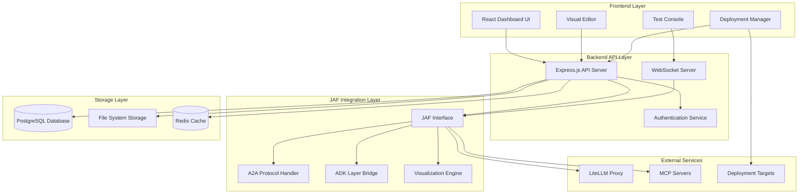

# Design Document

## Overview

The No-Code Agent Builder Dashboard is a comprehensive web-based interface that enables users to visually create, configure, test, and deploy AI agents using the Juspay Agent Framework (JAF). The system will provide an intuitive drag-and-drop interface that abstracts the complexity of the JAF framework while maintaining full access to its powerful features including A2A protocol support, multi-agent coordination, and advanced tool integration.

The dashboard will be built as a modern React-based single-page application with a Node.js backend that integrates directly with the JAF framework. It will support both the core JAF engine and the ADK (Agent Development Kit) layer, providing users with flexibility in how they build their agents.

## Architecture

### High-Level Architecture



### Component Architecture

The system follows a modular architecture with clear separation of concerns:

1. **Frontend Components**: React-based UI components for visual agent building
2. **Backend Services**: RESTful API and WebSocket services for real-time interaction
3. **JAF Integration**: Direct integration with JAF core, A2A protocol, and ADK layer
4. **Storage Systems**: Persistent storage for agent configurations and user data
5. **External Integrations**: LLM providers, MCP servers, and deployment targets

## Components and Interfaces

### Frontend Components

#### 1. Visual Agent Builder
- **Drag-and-Drop Canvas**: Main workspace for building agents visually
- **Component Palette**: Library of available tools, models, and configurations
- **Property Inspector**: Context-sensitive configuration panel
- **Connection Manager**: Visual representation of agent relationships and handoffs

```typescript
interface AgentBuilderProps {
  agentId?: string;
  onSave: (agent: AgentConfiguration) => Promise<void>;
  onTest: (agent: AgentConfiguration) => void;
  readonly?: boolean;
}

interface AgentConfiguration {
  id: string;
  name: string;
  description: string;
  model: Model;
  instruction: string;
  tools: ToolConfiguration[];
  a2aConfig?: A2AConfiguration;
  memoryConfig: MemoryConfiguration;
  handoffs?: string[];
  metadata: AgentMetadata;
}
```

#### 2. Tool Configuration Interface
- **Tool Library**: Pre-built tools with visual representations
- **Custom Tool Builder**: Form-based interface for creating custom tools
- **Parameter Editor**: Dynamic form generation based on tool schemas
- **Validation Display**: Real-time validation feedback

```typescript
interface ToolConfiguration {
  id: string;
  name: string;
  description: string;
  type: ToolType;
  parameters: ToolParameter[];
  implementation?: CustomToolImplementation;
  source: ToolSource;
  metadata: ToolMetadata;
}

interface CustomToolImplementation {
  language: 'javascript' | 'python';
  code: string;
  dependencies?: string[];
  environment?: Record<string, string>;
}
```

#### 3. A2A Protocol Configuration
- **Agent Card Builder**: Visual interface for creating agent cards
- **Skill Definition**: Form-based skill configuration
- **Capability Settings**: Toggle switches for A2A capabilities
- **Protocol Validation**: Real-time validation against A2A specifications

```typescript
interface A2AConfiguration {
  enabled: boolean;
  agentCard: AgentCardConfiguration;
  skills: SkillConfiguration[];
  capabilities: A2ACapabilities;
  security: SecurityConfiguration;
}

interface AgentCardConfiguration {
  name: string;
  description: string;
  version: string;
  provider: ProviderConfiguration;
  inputModes: string[];
  outputModes: string[];
}
```

#### 4. Test Console
- **Chat Interface**: Real-time testing with agent responses
- **Tool Execution Viewer**: Detailed view of tool calls and results
- **State Inspector**: Real-time view of agent state and memory
- **Performance Metrics**: Response times, token usage, and error rates

```typescript
interface TestConsoleProps {
  agent: AgentConfiguration;
  onMessageSend: (message: string) => void;
  messages: TestMessage[];
  isLoading: boolean;
  metrics: TestMetrics;
}

interface TestMessage {
  id: string;
  role: 'user' | 'agent' | 'system';
  content: string;
  timestamp: Date;
  toolCalls?: ToolCall[];
  metadata?: Record<string, any>;
}
```

### Backend Services

#### 1. Agent Management Service
- **CRUD Operations**: Create, read, update, delete agent configurations
- **Validation Service**: Validate agent configurations against JAF schemas
- **Version Control**: Track changes and maintain agent versions
- **Import/Export**: Handle agent configuration serialization

```typescript
class AgentManagementService {
  async createAgent(config: AgentConfiguration): Promise<Agent>;
  async updateAgent(id: string, config: Partial<AgentConfiguration>): Promise<Agent>;
  async deleteAgent(id: string): Promise<void>;
  async getAgent(id: string): Promise<Agent | null>;
  async listAgents(userId: string): Promise<Agent[]>;
  async validateAgent(config: AgentConfiguration): Promise<ValidationResult>;
  async exportAgent(id: string): Promise<AgentExport>;
  async importAgent(data: AgentExport): Promise<Agent>;
}
```

#### 2. JAF Integration Service
- **Agent Compilation**: Convert visual configurations to JAF agents
- **Runtime Management**: Start, stop, and monitor agent instances
- **A2A Server Management**: Deploy and manage A2A-enabled agents
- **Tool Registry**: Manage custom and built-in tools

```typescript
class JAFIntegrationService {
  async compileAgent(config: AgentConfiguration): Promise<JAFAgent>;
  async startAgent(id: string): Promise<AgentInstance>;
  async stopAgent(id: string): Promise<void>;
  async testAgent(config: AgentConfiguration, message: string): Promise<TestResult>;
  async deployA2AAgent(config: AgentConfiguration): Promise<A2ADeployment>;
  async registerTool(tool: ToolConfiguration): Promise<void>;
}
```

#### 3. Real-time Communication Service
- **WebSocket Management**: Handle real-time communication with frontend
- **Event Broadcasting**: Broadcast agent events and status updates
- **Session Management**: Manage test sessions and conversations
- **Stream Handling**: Handle streaming responses from agents

```typescript
class RealtimeService {
  async handleConnection(socket: WebSocket, userId: string): Promise<void>;
  async broadcastEvent(event: AgentEvent): Promise<void>;
  async startTestSession(agentId: string, userId: string): Promise<TestSession>;
  async handleMessage(sessionId: string, message: string): Promise<void>;
  async streamResponse(sessionId: string, response: AsyncIterable<any>): Promise<void>;
}
```

### Data Models

#### 1. User and Authentication
```typescript
interface User {
  id: string;
  email: string;
  name: string;
  role: UserRole;
  permissions: Permission[];
  createdAt: Date;
  lastLoginAt?: Date;
}

enum UserRole {
  ADMIN = 'admin',
  DEVELOPER = 'developer',
  USER = 'user'
}

interface Permission {
  resource: string;
  actions: string[];
}
```

#### 2. Agent Storage
```typescript
interface StoredAgent {
  id: string;
  userId: string;
  name: string;
  description: string;
  configuration: AgentConfiguration;
  status: AgentStatus;
  deployments: Deployment[];
  versions: AgentVersion[];
  createdAt: Date;
  updatedAt: Date;
}

enum AgentStatus {
  DRAFT = 'draft',
  ACTIVE = 'active',
  DEPLOYED = 'deployed',
  ARCHIVED = 'archived'
}
```

#### 3. Deployment Tracking
```typescript
interface Deployment {
  id: string;
  agentId: string;
  type: DeploymentType;
  status: DeploymentStatus;
  endpoint?: string;
  configuration: DeploymentConfiguration;
  metrics: DeploymentMetrics;
  createdAt: Date;
  updatedAt: Date;
}

enum DeploymentType {
  LOCAL = 'local',
  A2A_SERVER = 'a2a_server',
  CLOUD = 'cloud',
  CONTAINER = 'container'
}
```

## Error Handling

### Frontend Error Handling
- **Global Error Boundary**: Catch and display React component errors
- **API Error Handling**: Standardized error responses with user-friendly messages
- **Validation Errors**: Real-time validation with contextual error messages
- **Network Error Recovery**: Automatic retry and offline mode support

```typescript
interface ErrorBoundaryState {
  hasError: boolean;
  error?: Error;
  errorInfo?: ErrorInfo;
}

interface APIError {
  code: string;
  message: string;
  details?: Record<string, any>;
  timestamp: Date;
}
```

### Backend Error Handling
- **Structured Error Responses**: Consistent error format across all endpoints
- **JAF Error Translation**: Convert JAF errors to user-friendly messages
- **Logging and Monitoring**: Comprehensive error logging with context
- **Graceful Degradation**: Fallback behavior when services are unavailable

```typescript
class ErrorHandler {
  static handleJAFError(error: JAFError): APIError;
  static handleValidationError(error: ValidationError): APIError;
  static handleSystemError(error: Error): APIError;
  static logError(error: Error, context: Record<string, any>): void;
}
```

## Testing Strategy

### Unit Testing
- **Frontend Components**: Jest and React Testing Library for component testing
- **Backend Services**: Jest for service layer testing with mocked dependencies
- **JAF Integration**: Isolated testing of JAF wrapper functions
- **Utility Functions**: Comprehensive testing of helper functions

### Integration Testing
- **API Endpoints**: Supertest for HTTP endpoint testing
- **Database Operations**: Test database operations with test containers
- **JAF Integration**: End-to-end testing with actual JAF agents
- **WebSocket Communication**: Testing real-time features

### End-to-End Testing
- **User Workflows**: Playwright for complete user journey testing
- **Agent Creation**: Test complete agent creation and deployment flow
- **Cross-browser Testing**: Ensure compatibility across major browsers
- **Performance Testing**: Load testing for concurrent users

### Testing Infrastructure
```typescript
// Test configuration
interface TestConfig {
  database: {
    url: string;
    resetBetweenTests: boolean;
  };
  jaf: {
    mockMode: boolean;
    testAgents: AgentConfiguration[];
  };
  external: {
    mockLLM: boolean;
    mockMCP: boolean;
  };
}

// Test utilities
class TestUtils {
  static createTestUser(): User;
  static createTestAgent(): AgentConfiguration;
  static mockJAFResponse(response: any): void;
  static setupTestDatabase(): Promise<void>;
  static cleanupTestData(): Promise<void>;
}
```

## Security Considerations

### Authentication and Authorization
- **JWT-based Authentication**: Secure token-based authentication
- **Role-based Access Control**: Granular permissions for different user types
- **API Key Management**: Secure storage and rotation of external API keys
- **Session Management**: Secure session handling with proper expiration

### Data Protection
- **Input Sanitization**: Prevent XSS and injection attacks
- **Configuration Validation**: Validate all agent configurations before execution
- **Secure Storage**: Encrypt sensitive data at rest
- **Audit Logging**: Comprehensive logging of user actions and system events

### Agent Security
- **Sandboxed Execution**: Isolate agent execution environments
- **Tool Validation**: Validate custom tools before execution
- **Resource Limits**: Prevent resource exhaustion attacks
- **Network Security**: Secure communication with external services

```typescript
interface SecurityConfig {
  authentication: {
    jwtSecret: string;
    tokenExpiration: string;
    refreshTokenExpiration: string;
  };
  encryption: {
    algorithm: string;
    keyRotationInterval: string;
  };
  rateLimit: {
    windowMs: number;
    maxRequests: number;
  };
  sandbox: {
    enabled: boolean;
    memoryLimit: string;
    timeoutMs: number;
  };
}
```

## Performance Optimization

### Frontend Performance
- **Code Splitting**: Lazy loading of components and routes
- **Memoization**: React.memo and useMemo for expensive operations
- **Virtual Scrolling**: Efficient rendering of large lists
- **Bundle Optimization**: Tree shaking and minification

### Backend Performance
- **Caching Strategy**: Redis caching for frequently accessed data
- **Database Optimization**: Proper indexing and query optimization
- **Connection Pooling**: Efficient database connection management
- **Async Processing**: Background processing for heavy operations

### JAF Integration Performance
- **Agent Pooling**: Reuse agent instances for better performance
- **Streaming Responses**: Real-time streaming for better user experience
- **Memory Management**: Efficient memory usage for long-running agents
- **Load Balancing**: Distribute agent workload across instances

```typescript
interface PerformanceConfig {
  cache: {
    ttl: number;
    maxSize: number;
    strategy: 'lru' | 'lfu';
  };
  database: {
    poolSize: number;
    connectionTimeout: number;
    queryTimeout: number;
  };
  agents: {
    poolSize: number;
    idleTimeout: number;
    maxConcurrent: number;
  };
}
```

## Deployment Architecture

### Development Environment
- **Local Development**: Docker Compose setup with all services
- **Hot Reloading**: Real-time code updates during development
- **Mock Services**: Mocked external dependencies for offline development
- **Debug Tools**: Integrated debugging and profiling tools

### Production Environment
- **Containerization**: Docker containers for all services
- **Orchestration**: Kubernetes for container orchestration
- **Load Balancing**: NGINX for load balancing and SSL termination
- **Monitoring**: Prometheus and Grafana for system monitoring

### Scalability Considerations
- **Horizontal Scaling**: Scale individual services based on demand
- **Database Sharding**: Partition data for better performance
- **CDN Integration**: Content delivery network for static assets
- **Auto-scaling**: Automatic scaling based on resource usage

```yaml
# Docker Compose configuration
version: '3.8'
services:
  frontend:
    build: ./frontend
    ports:
      - "3000:3000"
    environment:
      - REACT_APP_API_URL=http://localhost:8000
  
  backend:
    build: ./backend
    ports:
      - "8000:8000"
    environment:
      - DATABASE_URL=postgresql://user:pass@db:5432/agents
      - REDIS_URL=redis://redis:6379
    depends_on:
      - db
      - redis
  
  db:
    image: postgres:15
    environment:
      - POSTGRES_DB=agents
      - POSTGRES_USER=user
      - POSTGRES_PASSWORD=pass
    volumes:
      - postgres_data:/var/lib/postgresql/data
  
  redis:
    image: redis:7
    volumes:
      - redis_data:/data

volumes:
  postgres_data:
  redis_data:
```

This design provides a comprehensive foundation for building a no-code agent builder dashboard that fully leverages the JAF framework's capabilities while providing an intuitive user experience.