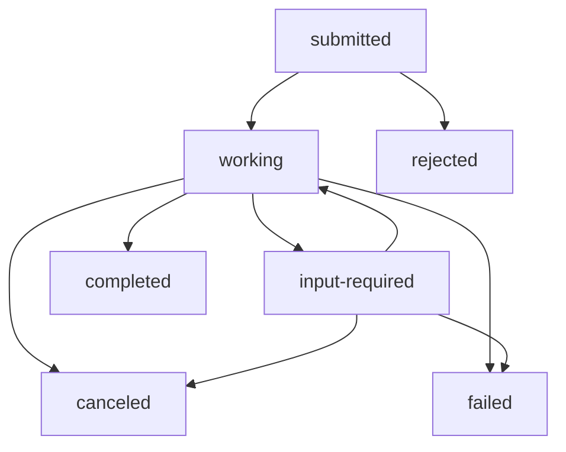

# A2A (Agent-to-Agent) Protocol

## Overview

The A2A (Agent-to-Agent) protocol in FAF provides a standardized communication layer that allows agents to interact with each other across different systems and implementations. Built on JSON-RPC 2.0, the protocol maintains FAF's functional programming principles while enabling seamless agent interoperability.

### Key Features

- **Pure Functional Implementation**: All A2A functionality implemented as pure functions with no side effects
- **Immutable State Management**: Task state and data are immutable and passed explicitly
- **Task Lifecycle Management**: Complete task tracking from submission to completion
- **Multiple Storage Providers**: Support for in-memory, Redis, and PostgreSQL storage
- **Type Safety**: Full TypeScript support with Zod schema validation
- **Streaming Support**: Real-time updates via Server-Sent Events
- **Agent Discovery**: Automatic Agent Card generation for service discovery

### Protocol Compliance

FAF's A2A implementation follows the [Agent-to-Agent Protocol Specification](https://a2a-protocol.org) version 0.3.0, ensuring compatibility with other A2A-enabled systems.

## Task Management System

### Task Lifecycle States

Tasks in the A2A protocol progress through a defined lifecycle with the following states:

```typescript
type TaskState = 
  | 'submitted'      // Initial state when task is received
  | 'working'        // Agent is actively processing the task
  | 'input-required' // Agent needs additional input from user
  | 'completed'      // Task has been successfully completed
  | 'canceled'       // Task was canceled before completion
  | 'failed'         // Task failed due to an error
  | 'rejected'       // Task was rejected by the agent
  | 'auth-required'  // Task requires authentication
  | 'unknown';       // State is unknown or undefined
```

#### State Transitions



### Task Structure

```typescript
type A2ATask = {
  readonly id: string;                    // Unique task identifier
  readonly contextId: string;             // Session/conversation context
  readonly status: {
    readonly state: TaskState;            // Current task state
    readonly message?: A2AMessage;        // Optional status message
    readonly timestamp?: string;          // ISO timestamp of last update
  };
  readonly history?: readonly A2AMessage[]; // Message history
  readonly artifacts?: readonly A2AArtifact[]; // Generated artifacts
  readonly metadata?: Readonly<Record<string, any>>; // Additional metadata
  readonly kind: 'task';                  // Type discriminator
};
```

### Task Serialization and Storage

#### Serialization Format

Tasks are serialized for storage using a consistent format:

```typescript
interface A2ATaskSerialized {
  readonly taskId: string;        // Task ID for indexing
  readonly contextId: string;     // Context ID for grouping
  readonly state: string;         // Current state as string
  readonly taskData: string;      // Full task as JSON string
  readonly statusMessage?: string; // Serialized status message
  readonly createdAt: string;     // ISO creation timestamp
  readonly updatedAt: string;     // ISO last update timestamp
  readonly metadata?: string;     // Serialized metadata
}
```

#### Serialization Functions

```typescript
// Pure function to serialize task for storage
export const serializeA2ATask = (
  task: A2ATask,
  metadata?: Record<string, any>
): A2AResult<A2ATaskSerialized>;

// Pure function to deserialize task from storage
export const deserializeA2ATask = (
  stored: A2ATaskSerialized
): A2AResult<A2ATask>;

// Validate task data integrity
export const validateTaskIntegrity = (task: A2ATask): boolean;

// Sanitize task data for storage
export const sanitizeTask = (task: A2ATask): A2ATask;
```

### Storage Providers

FAF supports multiple storage backends for A2A tasks:

#### In-Memory Provider

Best for development and testing:

```typescript
const config: A2AInMemoryTaskConfig = {
  type: 'memory',
  keyPrefix: 'faf:a2a:tasks:',
  maxTasks: 10000,                    // Maximum total tasks
  maxTasksPerContext: 1000,           // Maximum tasks per context
  defaultTtl: 3600,                   // Default TTL in seconds
  cleanupInterval: 3600,              // Cleanup interval in seconds
  enableHistory: true,                // Store message history
  enableArtifacts: true               // Store task artifacts
};
```

#### Redis Provider

Recommended for production single-instance deployments:

```typescript
const config: A2ARedisTaskConfig = {
  type: 'redis',
  keyPrefix: 'faf:a2a:tasks:',
  host: 'localhost',
  port: 6379,
  password: 'optional-password',
  db: 0,
  defaultTtl: 86400,                  // 24 hours in seconds
  cleanupInterval: 3600,
  maxTasks: 100000,
  enableHistory: true,
  enableArtifacts: true
};
```

#### PostgreSQL Provider

Recommended for production multi-instance deployments:

```typescript
const config: A2APostgresTaskConfig = {
  type: 'postgres',
  keyPrefix: 'faf:a2a:tasks:',
  host: 'localhost',
  port: 5432,
  database: 'faf_a2a',
  username: 'postgres',
  password: 'password',
  ssl: false,
  tableName: 'a2a_tasks',
  maxConnections: 10,
  defaultTtl: 86400,
  cleanupInterval: 3600,
  maxTasks: 1000000,
  enableHistory: true,
  enableArtifacts: true
};
```

## API Reference

### Core Interfaces and Types

#### A2AMessage

```typescript
type A2AMessage = {
  readonly role: 'user' | 'agent';
  readonly parts: readonly A2APart[];
  readonly messageId: string;
  readonly contextId?: string;
  readonly taskId?: string;
  readonly kind: 'message';
  readonly metadata?: Readonly<Record<string, any>>;
  readonly extensions?: readonly string[];
  readonly referenceTaskIds?: readonly string[];
};
```

#### A2APart

```typescript
type A2APart = 
  | { readonly kind: 'text'; readonly text: string; readonly metadata?: Readonly<Record<string, any>> }
  | { readonly kind: 'data'; readonly data: Readonly<Record<string, any>>; readonly metadata?: Readonly<Record<string, any>> }
  | { readonly kind: 'file'; readonly file: A2AFile; readonly metadata?: Readonly<Record<string, any>> };
```

#### A2AArtifact

```typescript
type A2AArtifact = {
  readonly artifactId: string;
  readonly name?: string;
  readonly description?: string;
  readonly parts: readonly A2APart[];
  readonly metadata?: Readonly<Record<string, any>>;
  readonly extensions?: readonly string[];
};
```

### Provider API

#### A2ATaskProvider Interface

```typescript
type A2ATaskProvider = {
  // Store a new task
  readonly storeTask: (
    task: A2ATask,
    metadata?: { expiresAt?: Date; [key: string]: any }
  ) => Promise<A2AResult<void>>;

  // Retrieve task by ID
  readonly getTask: (taskId: string) => Promise<A2AResult<A2ATask | null>>;

  // Update existing task
  readonly updateTask: (
    task: A2ATask,
    metadata?: { [key: string]: any }
  ) => Promise<A2AResult<void>>;

  // Update task status (optimized for frequent updates)
  readonly updateTaskStatus: (
    taskId: string,
    state: TaskState,
    statusMessage?: any,
    timestamp?: string
  ) => Promise<A2AResult<void>>;

  // Search tasks by criteria
  readonly findTasks: (query: A2ATaskQuery) => Promise<A2AResult<A2ATask[]>>;

  // Get tasks by context ID
  readonly getTasksByContext: (
    contextId: string,
    limit?: number
  ) => Promise<A2AResult<A2ATask[]>>;

  // Delete a task
  readonly deleteTask: (taskId: string) => Promise<A2AResult<boolean>>;

  // Delete all tasks in a context
  readonly deleteTasksByContext: (contextId: string) => Promise<A2AResult<number>>;

  // Clean up expired tasks
  readonly cleanupExpiredTasks: () => Promise<A2AResult<number>>;

  // Get task statistics
  readonly getTaskStats: (contextId?: string) => Promise<A2AResult<{
    totalTasks: number;
    tasksByState: Record<TaskState, number>;
    oldestTask?: Date;
    newestTask?: Date;
  }>>;

  // Health check
  readonly healthCheck: () => Promise<A2AResult<{ 
    healthy: boolean; 
    latencyMs?: number; 
    error?: string 
  }>>;

  // Close/cleanup the provider
  readonly close: () => Promise<A2AResult<void>>;
};
```

### Query System

#### A2ATaskQuery

```typescript
interface A2ATaskQuery {
  readonly taskId?: string;           // Specific task ID
  readonly contextId?: string;        // Filter by context
  readonly state?: TaskState;         // Filter by state
  readonly limit?: number;            // Maximum results
  readonly offset?: number;           // Pagination offset
  readonly since?: Date;              // Tasks created/updated after
  readonly until?: Date;              // Tasks created/updated before
  readonly includeHistory?: boolean;  // Include message history
  readonly includeArtifacts?: boolean; // Include artifacts
}
```

#### Query Examples

```typescript
// Get all active tasks in a context
const activeTasks = await provider.findTasks({
  contextId: 'user_session_123',
  state: 'working',
  includeHistory: true
});

// Get recent completed tasks
const recentCompleted = await provider.findTasks({
  state: 'completed',
  since: new Date(Date.now() - 24 * 60 * 60 * 1000), // Last 24 hours
  limit: 50
});

// Get task statistics for monitoring
const stats = await provider.getTaskStats('user_session_123');
```

## Configuration Guide

### Provider Configurations

#### Environment Variables

All providers support configuration via environment variables:

```bash
# Provider type (memory, redis, postgres)
FAF_A2A_TASK_PROVIDER_TYPE=redis

# Common settings
FAF_A2A_TASK_PROVIDER_KEY_PREFIX=myapp:a2a:tasks:
FAF_A2A_TASK_PROVIDER_DEFAULT_TTL=86400
FAF_A2A_TASK_PROVIDER_CLEANUP_INTERVAL=3600
FAF_A2A_TASK_PROVIDER_MAX_TASKS=100000
FAF_A2A_TASK_PROVIDER_ENABLE_HISTORY=true
FAF_A2A_TASK_PROVIDER_ENABLE_ARTIFACTS=true

# Redis-specific
FAF_A2A_TASK_PROVIDER_REDIS_HOST=localhost
FAF_A2A_TASK_PROVIDER_REDIS_PORT=6379
FAF_A2A_TASK_PROVIDER_REDIS_PASSWORD=secret
FAF_A2A_TASK_PROVIDER_REDIS_DB=0

# PostgreSQL-specific
FAF_A2A_TASK_PROVIDER_POSTGRES_HOST=localhost
FAF_A2A_TASK_PROVIDER_POSTGRES_PORT=5432
FAF_A2A_TASK_PROVIDER_POSTGRES_DATABASE=faf_a2a
FAF_A2A_TASK_PROVIDER_POSTGRES_USERNAME=postgres
FAF_A2A_TASK_PROVIDER_POSTGRES_PASSWORD=secret
FAF_A2A_TASK_PROVIDER_POSTGRES_SSL=false
FAF_A2A_TASK_PROVIDER_POSTGRES_TABLE=a2a_tasks
FAF_A2A_TASK_PROVIDER_POSTGRES_MAX_CONNECTIONS=10
```

#### Environment-Based Setup

```typescript
import { createA2ATaskProviderFromEnv } from 'functional-agent-framework/a2a';

// Automatically creates provider based on environment variables
const provider = await createA2ATaskProviderFromEnv({
  redis: redisClient,      // Optional: provide existing clients
  postgres: postgresClient // Optional: provide existing clients
});
```

### Performance Tuning

#### Memory Provider Optimization

```typescript
const config: A2AInMemoryTaskConfig = {
  type: 'memory',
  maxTasks: 50000,              // Adjust based on available RAM
  maxTasksPerContext: 5000,     // Prevent context bloat
  cleanupInterval: 1800,        // More frequent cleanup (30 min)
  enableHistory: false,         // Disable if not needed
  enableArtifacts: false        // Disable if not needed
};
```

#### Redis Optimization

```typescript
const config: A2ARedisTaskConfig = {
  type: 'redis',
  defaultTtl: 43200,            // 12 hours for faster cleanup
  cleanupInterval: 900,         // 15-minute cleanup cycles
  keyPrefix: 'faf:a2a:',       // Shorter prefix saves space
  enableHistory: true,          // Redis handles this efficiently
  enableArtifacts: true
};
```

#### PostgreSQL Optimization

```typescript
const config: A2APostgresTaskConfig = {
  type: 'postgres',
  maxConnections: 20,           // Adjust based on concurrent load
  defaultTtl: 604800,          // 7 days (longer for analytics)
  cleanupInterval: 3600,        // Hourly cleanup
  enableHistory: true,
  enableArtifacts: true
};
```

## Usage Examples

### Basic Task Creation and Management

```typescript
import { 
  createA2ATaskProvider,
  createA2ATask,
  updateA2ATaskStatus,
  completeA2ATask 
} from 'functional-agent-framework/a2a';

// Create provider
const provider = await createA2ATaskProvider({
  type: 'memory',
  maxTasks: 1000
});

// Create a new task
const task = createA2ATask(
  'task_123',
  'user_session_456',
  'submitted',
  {
    role: 'user',
    parts: [{ kind: 'text', text: 'Please analyze this document' }],
    messageId: 'msg_789',
    contextId: 'user_session_456',
    kind: 'message'
  }
);

// Store the task
const storeResult = await provider.storeTask(task);

// Update task status
await provider.updateTaskStatus(
  'task_123',
  'working',
  {
    role: 'agent',
    parts: [{ kind: 'text', text: 'Starting document analysis...' }],
    messageId: 'msg_status_1',
    contextId: 'user_session_456',
    kind: 'message'
  }
);

// Complete the task
const completedTask = completeA2ATask(task, {
  role: 'agent',
  parts: [
    { kind: 'text', text: 'Analysis complete!' },
    { kind: 'data', data: { wordCount: 1500, sentiment: 'positive' } }
  ],
  messageId: 'msg_result',
  contextId: 'user_session_456',
  kind: 'message'
});

await provider.updateTask(completedTask);
```

### Multi-Agent Task Coordination

```typescript
// Agent A creates a task for Agent B
const coordinationTask = createA2ATask(
  'coord_task_456',
  'multi_agent_session',
  'submitted',
  {
    role: 'agent',
    parts: [{ 
      kind: 'data', 
      data: { 
        request: 'weather_analysis',
        location: 'Tokyo',
        delegatedFrom: 'travel_planner_agent'
      }
    }],
    messageId: 'msg_delegation',
    contextId: 'multi_agent_session',
    kind: 'message',
    referenceTaskIds: ['parent_task_123'] // Reference to parent task
  }
);

// Store coordination task
await provider.storeTask(coordinationTask);

// Agent B processes the delegated task
await provider.updateTaskStatus(
  'coord_task_456',
  'working',
  {
    role: 'agent',
    parts: [{ kind: 'text', text: 'Weather agent processing request...' }],
    messageId: 'msg_weather_working',
    contextId: 'multi_agent_session',
    kind: 'message'
  }
);

// Agent B completes with results
const weatherResult = {
  role: 'agent' as const,
  parts: [
    { kind: 'text', text: 'Weather analysis for Tokyo complete' },
    { 
      kind: 'data', 
      data: { 
        location: 'Tokyo',
        temperature: 22,
        conditions: 'sunny',
        recommendation: 'excellent_travel_weather'
      }
    }
  ],
  messageId: 'msg_weather_complete',
  contextId: 'multi_agent_session',
  kind: 'message' as const
};

await provider.updateTaskStatus('coord_task_456', 'completed', weatherResult);

// Agent A retrieves the results
const completedCoordTask = await provider.getTask('coord_task_456');
if (completedCoordTask.success && completedCoordTask.data) {
  const results = completedCoordTask.data.status.message;
  // Process weather data in travel planning...
}
```

### Error Handling

```typescript
// Robust error handling with A2A results
const handleTaskOperation = async (taskId: string) => {
  const taskResult = await provider.getTask(taskId);
  
  if (!taskResult.success) {
    switch (taskResult.error._tag) {
      case 'A2ATaskNotFoundError':
        console.log(`Task ${taskId} not found`);
        return null;
        
      case 'A2ATaskStorageError':
        console.error('Storage error:', taskResult.error.message);
        throw new Error('Database unavailable');
        
      case 'A2ATaskError':
        console.error('Task error:', taskResult.error.message);
        throw new Error('Task processing failed');
        
      default:
        console.error('Unknown error:', taskResult.error);
        throw new Error('Unexpected error');
    }
  }
  
  return taskResult.data;
};

// Handle task updates with retries
const updateTaskWithRetry = async (
  taskId: string, 
  state: TaskState,
  maxRetries: number = 3
) => {
  for (let attempt = 1; attempt <= maxRetries; attempt++) {
    const result = await provider.updateTaskStatus(taskId, state);
    
    if (result.success) {
      return result;
    }
    
    if (attempt < maxRetries) {
      console.warn(`Update attempt ${attempt} failed, retrying...`);
      await new Promise(resolve => setTimeout(resolve, 1000 * attempt));
    } else {
      console.error('All update attempts failed:', result.error);
      throw new Error('Failed to update task after retries');
    }
  }
};
```

### Task Monitoring and Cleanup

```typescript
// Monitor task statistics
const monitorTasks = async (contextId?: string) => {
  const statsResult = await provider.getTaskStats(contextId);
  
  if (statsResult.success) {
    const stats = statsResult.data;
    console.log('Task Statistics:', {
      total: stats.totalTasks,
      byState: stats.tasksByState,
      oldest: stats.oldestTask,
      newest: stats.newestTask
    });
    
    // Alert if too many failed tasks
    if (stats.tasksByState.failed > 10) {
      console.warn('High number of failed tasks detected!');
    }
  }
};

// Cleanup expired tasks
const performCleanup = async () => {
  const cleanupResult = await provider.cleanupExpiredTasks();
  
  if (cleanupResult.success) {
    console.log(`Cleaned up ${cleanupResult.data} expired tasks`);
  } else {
    console.error('Cleanup failed:', cleanupResult.error);
  }
};

// Health check monitoring
const checkProviderHealth = async () => {
  const healthResult = await provider.healthCheck();
  
  if (healthResult.success) {
    const health = healthResult.data;
    if (health.healthy) {
      console.log(`Provider healthy (${health.latencyMs}ms latency)`);
    } else {
      console.error('Provider unhealthy:', health.error);
    }
  }
};
```

## Migration Guide

### Switching Between Providers

#### From In-Memory to Redis

```typescript
// 1. Export tasks from in-memory provider
const memoryProvider = await createSimpleA2ATaskProvider('memory');
const allTasks = await memoryProvider.findTasks({ limit: 10000 });

// 2. Create Redis provider
const redisProvider = await createSimpleA2ATaskProvider('redis', redisClient);

// 3. Migrate tasks
if (allTasks.success) {
  for (const task of allTasks.data) {
    await redisProvider.storeTask(task);
  }
}

// 4. Update application configuration
// Update environment variables or config to use Redis
```

#### From Redis to PostgreSQL

```typescript
// 1. Create PostgreSQL provider
const postgresProvider = await createSimpleA2ATaskProvider('postgres', pgClient);

// 2. Create migration utility
const migrateFromRedis = async (
  sourceProvider: A2ATaskProvider,
  targetProvider: A2ATaskProvider,
  batchSize: number = 100
) => {
  let offset = 0;
  let migrated = 0;
  
  while (true) {
    const batch = await sourceProvider.findTasks({ 
      limit: batchSize, 
      offset 
    });
    
    if (!batch.success || batch.data.length === 0) {
      break;
    }
    
    // Migrate batch
    for (const task of batch.data) {
      const result = await targetProvider.storeTask(task);
      if (result.success) {
        migrated++;
      }
    }
    
    offset += batchSize;
    console.log(`Migrated ${migrated} tasks...`);
  }
  
  console.log(`Migration complete: ${migrated} tasks migrated`);
};

await migrateFromRedis(redisProvider, postgresProvider);
```

### Data Migration Utilities

#### Backup and Restore

```typescript
// Backup tasks to JSON file
const backupTasks = async (provider: A2ATaskProvider, filename: string) => {
  const allTasks = await provider.findTasks({ 
    includeHistory: true, 
    includeArtifacts: true 
  });
  
  if (allTasks.success) {
    const backup = {
      timestamp: new Date().toISOString(),
      version: '1.0.0',
      taskCount: allTasks.data.length,
      tasks: allTasks.data
    };
    
    await fs.writeFile(filename, JSON.stringify(backup, null, 2));
    console.log(`Backed up ${backup.taskCount} tasks to ${filename}`);
  }
};

// Restore tasks from JSON file
const restoreTasks = async (provider: A2ATaskProvider, filename: string) => {
  const backupData = JSON.parse(await fs.readFile(filename, 'utf-8'));
  
  let restored = 0;
  for (const task of backupData.tasks) {
    const result = await provider.storeTask(task);
    if (result.success) {
      restored++;
    }
  }
  
  console.log(`Restored ${restored}/${backupData.taskCount} tasks`);
};
```

#### Migration Validation

```typescript
// Validate migration completeness
const validateMigration = async (
  sourceProvider: A2ATaskProvider,
  targetProvider: A2ATaskProvider
) => {
  const sourceStats = await sourceProvider.getTaskStats();
  const targetStats = await targetProvider.getTaskStats();
  
  if (sourceStats.success && targetStats.success) {
    const sourceCount = sourceStats.data.totalTasks;
    const targetCount = targetStats.data.totalTasks;
    
    console.log(`Source: ${sourceCount} tasks, Target: ${targetCount} tasks`);
    
    if (sourceCount === targetCount) {
      console.log('✅ Migration validation passed');
      return true;
    } else {
      console.error('❌ Migration validation failed: task count mismatch');
      return false;
    }
  }
  
  return false;
};
```

## Best Practices

### Task Management

1. **Use appropriate TTL values** based on your use case
2. **Implement regular cleanup** to prevent storage bloat
3. **Monitor task statistics** for performance insights
4. **Handle errors gracefully** with proper error types
5. **Use context IDs** to group related tasks

### Provider Selection

- **In-Memory**: Development, testing, small deployments
- **Redis**: Single-instance production, moderate scale
- **PostgreSQL**: Multi-instance production, large scale, analytics

### Performance Optimization

1. **Tune cleanup intervals** based on task volume
2. **Use appropriate batch sizes** for bulk operations
3. **Index frequently queried fields** in PostgreSQL
4. **Monitor memory usage** with in-memory provider
5. **Use connection pooling** for database providers

The A2A protocol implementation in FAF provides a robust, scalable foundation for agent-to-agent communication while maintaining the framework's functional programming principles and type safety guarantees.