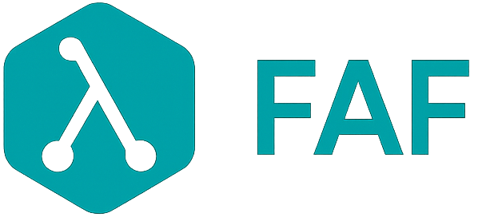

**User:**

<task>
what all types of hooks do we have . Also enlighten me on all the cases etc that I can use to achieve below 
Orchestrator + Reviewer + agentic design 
what all must be present ?
Planning stage
enrichment of query as a tool ;>
planning into substeps and  choosing tools agents to execute this query .
while planning orch will first take stock of what agents can we run via the agentExecutorTool .
we will have agent recommendation tool that will give ranking and score of agents to use here
we will have multiple MCP agents too so we must take stock of which tools are effective and which are not and must decide which tools we will use itself in the first place
We will handle MCP agents separately as we just have to  use the tools and decide which tools are ideal here .
so 1st select MCP agents seeming suitable for this task . send finalize on what tools needs to be used in that MCP agent. 
Therefore mCP tool will  have a planning tool workflow kindthing which we will use in planning stage or choosing which kind of tools we want to use 

Let's say we have sub goals defined , we must go to planning stage for each goal when it comes or we must plan for all substeps beforehand before starting execution  ?

MyIntution : planning - > Action -> refine per sub goal .

regarding tool cost : Time , money approx have a function schema to use this (optional) while creating a tool . Iin Orch agent when we are planning we can optionally make use of these 

Orch agent  can run multiple tools in parallel ,sequential in one iteration ?

For action : we need to refine the parameters we will pass to tools . this is a step in itself . The  parameters can be dependant on previous tool call result ... independant etc. 

In next iteration we might want to try different tool parameters for some tools how will we achieve this ?And also the iterative process i=1,2, we need to factor this is in in some stage 
Tools output must be fixed json formated (fixed format) 

Action : achieve a tool result 

Eval and feedback
when say one iteration comes to an end take stock of the result and then 
1) decide if further iterations are required ..
2) change / tweaks in planning are required ?
3) feedback per tool result . and decide if change in plan is required or not
4) Update how many sub goals of full task have we completed so far

For iterative in tool parameter value selection -> take stock of previous tool params and decide if same or other params are required.

in interative fashion , in planning stage we must focus on what sub goal now we need to focus on  of the remaining steps ... 

plan on the tools etc


Remove agents from output if once used before . Or we must use other agents from the list we had that we had thhe output in the first planning iteration ?

No I think , if while planning we got many agents relevant for this task we must use all of them at the same time .
 Okay , What if 1st substep requires an agent and then second substep the agent requirement can change ... ?
 Wemay need the first agent that we used again too . or the relevance of agents we got can reduce for the remaining substeps ..
 
 In planning how should we sequence it first get the agent capabilities and then subs goal setting or first goal setting and task  listing and then agent selection tool call ??

above are my thinking excrepts of finalizing the design for agentic backend of my app .
it has a lot of questions doubts . Help me resolve them . I will implement this using JAF .
While answering don't add code blocks . Focus on design and how we will achive these with JAF .
Also in between if we feel we need USer Input (HITL) we can pause our iteration loop and ask agent for it's permission let's say of  proceeding further with execution or resolving any anomalies . e.g we have 2 Alex we can ask user if we want both . we must have a tool flow for this too (User interaction) somewhere .
Answer and help with the doubts , questions above in design excerpts and suggest improvements too in the design .


Suggest hooks tools , agents agentsAs tool etc features that I must be aware of while implementning above system
</task>

# TODO LIST RECOMMENDED

When starting a new task, it is recommended to create a todo list.


1. Include the task_progress parameter in your next tool call
2. Create a comprehensive checklist of all steps needed
3. Use markdown format: - [ ] for incomplete, - [x] for complete

**Benefits of creating a todo list now:**
	- Clear roadmap for implementation
	- Progress tracking throughout the task
	- Nothing gets forgotten or missed
	- Users can see, monitor, and edit the plan

**Example structure:**```
- [ ] Analyze requirements
- [ ] Set up necessary files
- [ ] Implement main functionality
- [ ] Handle edge cases
- [ ] Test the implementation
- [ ] Verify results```

Keeping the todo list updated helps track progress and ensures nothing is missed.

<environment_details>
# Visual Studio Code Visible Files
docs/llm-prompting-and-turns.md

# Visual Studio Code Open Tabs
src/core/engine.ts
docs/llm-prompting-and-turns.md
examples/ai-sdk-provider-demo/.env
examples/ai-sdk-provider-demo/test-vertex.ts
src/a2a/examples/weather-agent.ts
src/a2a/examples/server-example.ts
src/a2a/agent.ts
src/providers/model_prices.json
../../../MinerU/juspay.pdf-63fedba3-847e-467c-8e79-629d602f318d/full.md
src/adk/index.ts
src/providers/index.ts
examples/ai-sdk-provider-demo/test.ts
examples/streaming-demo/stream-plain.ts

# Current Time
11/7/2025, 4:35:46 PM (Asia/Calcutta, UTC+5.5:00)

# Current Working Directory (/Users/aayush.shah/Desktop/projects/jaf) Files
.env.test
.eslintrc.js
.gitignore
.npmignore
CHANGELOG_EVENT_IMPROVEMENTS.md
docker-compose.test.yml
jest.config.js
jest.setup.js
LICENSE
mkdocs.yml
package.json
pnpm-lock.yaml
pnpm-workspace.yaml
QUICK_REFERENCE_EVENT_HANDLERS.md
README.md
requirements.txt
tsconfig.json
dependencies/
dependencies/pdf-parse/
dependencies/pdf-parse/.editorconfig
dependencies/pdf-parse/.gitignore
dependencies/pdf-parse/.gitlab-ci.yml
dependencies/pdf-parse/.jsbeautifyrc
dependencies/pdf-parse/.npmrc
dependencies/pdf-parse/CHANGELOG
dependencies/pdf-parse/CONTRIBUTING.md
dependencies/pdf-parse/index.d.ts
dependencies/pdf-parse/index.js
dependencies/pdf-parse/LICENSE
dependencies/pdf-parse/NOTES.md
dependencies/pdf-parse/package.json
dependencies/pdf-parse/QUICKSTART.js
dependencies/pdf-parse/README.md
dependencies/pdf-parse/lib/
dependencies/pdf-parse/test/
docs/
docs/a2a-integration.md
docs/a2a-protocol.md
docs/adk-analysis.md
docs/adk-layer.md
docs/agents-as-tools.md
docs/api-reference.md
docs/CONTRIBUTING.md
docs/core-concepts.md
docs/cover.png
docs/deployment.md
docs/event-handling-guide.md
docs/examples.md
docs/favicon.png
docs/getting-started.md
docs/jaf-adk-layer-plan.md
docs/llm-prompting-and-turns.md
docs/logo.png
docs/memory-system.md
docs/model-providers.md
docs/new-features.md
docs/README.md
docs/safe-logging.md
docs/sanitization.md
docs/serve.sh
docs/server-api.md
docs/tools.md
docs/trace-events-reference.md
docs/tracing.md
docs/troubleshooting.md
docs/visualization.md
docs/stylesheets/
docs/stylesheets/extra.css
examples/
examples/attachment-demo-server.ts
examples/custom-sanitization-example.ts
examples/guardrails-demo.ts
examples/safe-logging-example.ts
examples/verify-param-modification.ts
examples/agent-as-tool-demo/
examples/agent-as-tool-demo/.env.example
examples/agent-as-tool-demo/index.ts
examples/agent-as-tool-demo/package.json
examples/agent-as-tool-demo/README.md
examples/agent-as-tool-demo/tsconfig.json
examples/ai-sdk-provider-demo/
examples/ai-sdk-provider-demo/.env.example
examples/ai-sdk-provider-demo/package.json
examples/ai-sdk-provider-demo/reasoning-ui-example.tsx
examples/ai-sdk-provider-demo/server.ts
examples/ai-sdk-provider-demo/test-vertex.ts
examples/ai-sdk-provider-demo/test.ts
examples/ai-sdk-provider-demo/tsconfig.json
examples/flight-booking/
examples/flight-booking/.env.example
examples/flight-booking/index.ts
examples/flight-booking/jaf-server.ts
examples/flight-booking/multi-agent.ts
examples/flight-booking/package.json
examples/flight-booking/README.md
examples/flight-booking/tsconfig.json
examples/hitl-demo/
examples/hitl-demo/.env.example
examples/hitl-demo/api-demo.ts
examples/hitl-demo/index.ts
examples/hitl-demo/package.json
examples/hitl-demo/README.md
examples/hitl-demo/run-server.ts
examples/hitl-demo/tsconfig.json
examples/hitl-demo/shared/
examples/math-tool-demo/
examples/math-tool-demo/index.ts
examples/math-tool-demo/package.json
examples/math-tool-demo/README.md
examples/math-tool-demo/tsconfig.json
examples/mcp-demo/
examples/mcp-demo/.env.example
examples/mcp-demo/.gitignore
examples/mcp-demo/mcp-filesystem-server.ts
examples/mcp-demo/package.json
examples/mcp-demo/README.md
examples/mcp-demo/tsconfig.json
examples/mcp-http-demo/
examples/mcp-http-demo/index.ts
examples/mcp-http-demo/package.json
examples/mcp-http-demo/README.md
examples/mcp-http-demo/run-server.ts
examples/mcp-http-demo/tsconfig.json
examples/mcp-sse-demo/
examples/mcp-sse-demo/index.ts
examples/mcp-sse-demo/package.json
examples/mcp-sse-demo/README.md
examples/mcp-sse-demo/run-server.ts
examples/mcp-sse-demo/tsconfig.json
examples/otel-tracing-demo/
examples/otel-tracing-demo/.env.example
examples/otel-tracing-demo/otel-demo.ts
examples/otel-tracing-demo/package.json
examples/rag-demo/
examples/rag-demo/.env.example
examples/rag-demo/.gitignore
examples/rag-demo/DEMO_SUMMARY.md
examples/rag-demo/index.ts
examples/rag-demo/package.json
examples/rag-demo/rag-agent.ts
examples/rag-demo/rag-tool.ts
examples/rag-demo/README.md
examples/rag-demo/tsconfig.json
examples/server-demo/
examples/server-demo/.env.example
examples/server-demo/index.ts
examples/server-demo/package.json
examples/server-demo/README.md
examples/server-demo/tsconfig.json
examples/simple-event-handler-demo/
examples/simple-event-handler-demo/.env.example
examples/simple-event-handler-demo/.gitignore
examples/simple-event-handler-demo/DEMO_OUTPUT.md
examples/simple-event-handler-demo/index.ts
examples/simple-event-handler-demo/package.json
examples/simple-event-handler-demo/README.md
examples/simple-event-handler-demo/tsconfig.json
examples/streaming-demo/
examples/streaming-demo/package.json
examples/streaming-demo/README.md
examples/streaming-demo/server.ts
examples/streaming-demo/stream-direct.ts
examples/streaming-demo/stream-plain.ts
examples/streaming-demo/tsconfig.json
examples/visualization-demo/
examples/visualization-demo/index.ts
examples/visualization-demo/package.json
examples/visualization-demo/README.md
scripts/
scripts/setup-test-db.sh
scripts/teardown-test-db.sh
src/
src/index.ts
src/__tests__/
src/__tests__/agent-as-tool.test.ts
src/__tests__/engine.test.ts
src/__tests__/hitl.test.ts
src/__tests__/validation.test.ts
src/a2a/
src/a2a/agent-card.ts
src/a2a/agent.ts
src/a2a/client.ts
src/a2a/executor.ts
src/a2a/index.ts
src/a2a/protocol.ts
src/a2a/server.ts
src/a2a/__tests__/
src/a2a/examples/
src/a2a/memory/
src/adk/
src/core/
src/memory/
src/policies/
src/providers/
src/server/
src/test-utils/
src/tools/
src/types/
src/utils/
src/visualization/

(File list truncated. Use list_files on specific subdirectories if you need to explore further.)

# Workspace Configuration
{
  "workspaces": {
    "/Users/aayush.shah/Desktop/projects/jaf": {
      "hint": "jaf",
      "associatedRemoteUrls": [
        "origin: https://github.com/xynehq/jaf.git"
      ],
      "latestGitCommitHash": "6b97fee9bf8ff6c6bd5970d1c4969597c3e36860"
    }
  }
}

# Detected CLI Tools
These are some of the tools on the user's machine, and may be useful if needed to accomplish the task: git, docker, kubectl, gcloud, npm, pnpm, pip, curl, jq, make, python, node, mysql, sqlite3, code, grep, sed, awk, brew, bundle. This list is not exhaustive, and other tools may be available.

# Context Window Usage
0 / 200K tokens used (0%)

# Current Mode
ACT MODE
</environment_details>

---

**Assistant:**


I'll help you design this orchestrator + reviewer agentic system using JAF. Let me first explore the JAF codebase to understand the available features, then address your design questions.

<read_file>
<path>docs/core-concepts.md</path>
<task_progress>
- [ ] Understand JAF hooks and features
- [ ] Analyze agents-as-tools capability
- [ ] Review MCP integration
- [ ] Design orchestrator architecture
- [ ] Address specific design questions
- [ ] Provide recommendations
</task_progress>
</read_file>

<read_file>
<path>docs/

---

**User:**

[read_file for 'docs/core-concepts.md'] Result:
# Juspay Agent Framework (JAF) - Core Concepts

The Juspay Agent Framework (JAF) is a type-safe, functional programming framework for building AI agent systems. This guide covers the core concepts, type system, and architectural patterns that make JAF a robust foundation for agent development.

## Table of Contents

1. [Immutable State and RunState](#immutable-state-and-runstate)
2. [Agent Definition and Structure](#agent-definition-and-structure)
3. [Tool System Architecture](#tool-system-architecture)
4. [RunConfig and Configuration](#runconfig-and-configuration)
5. [Message Flow and Conversation Handling](#message-flow-and-conversation-handling)
6. [TraceId and RunId Concepts](#traceid-and-runid-concepts)
7. [Error Handling Patterns](#error-handling-patterns)
8. [Context and Typing](#context-and-typing)
9. [Memory Management](#memory-management)
10. [Functional Programming Principles](#functional-programming-principles)

## Immutable State and RunState

### Core Principle: Immutability

JAF follows strict functional programming principles where all state is immutable. The central state object, `RunState`, represents the complete execution context at any point in time and is never mutated - only new states are created.

```typescript
export type RunState<Ctx> = {
  readonly runId: RunId;
  readonly traceId: TraceId;
  readonly messages: readonly Message[];
  readonly currentAgentName: string;
  readonly context: Readonly<Ctx>;
  readonly turnCount: number;
};
```

### Key Properties

- **`runId`**: Unique identifier for the current execution run
- **`traceId`**: Identifier for tracing related runs across handoffs
- **`messages`**: Immutable array of conversation messages
- **`currentAgentName`**: Name of the currently active agent
- **`context`**: User-defined context object (read-only)
- **`turnCount`**: Number of turns completed in this run

### State Evolution

State evolution follows a pure functional pattern:

```typescript
// State is never mutated directly
const nextState: RunState<Ctx> = {
  ...state,
  messages: [...state.messages, newMessage],
  turnCount: state.turnCount + 1
};
```

This immutability ensures:
- **Predictable state transitions**
- **Easy debugging and tracing**
- **Thread safety**
- **Ability to replay executions**

## Agent Definition and Structure

### Agent Type Definition

Agents are the core execution units in JAF, defined as immutable configuration objects:

```typescript
export type Agent<Ctx, Out> = {
  readonly name: string;
  readonly instructions: (state: Readonly<RunState<Ctx>>) => string;
  readonly tools?: readonly Tool<any, Ctx>[];
  readonly outputCodec?: z.ZodType<Out>;
  readonly handoffs?: readonly string[];
  readonly modelConfig?: ModelConfig;
};
```

### Agent Components

#### 1. Instructions Function
The instructions function dynamically generates system prompts based on the current state:

```typescript
const dynamicAgent: Agent<MyContext, string> = {
  name: "dynamic-helper",
  instructions: (state) => {
    const messageCount = state.messages.length;
    const userName = state.context.user?.name || "User";
    
    return `You are a helpful assistant for ${userName}. 
            This conversation has ${messageCount} messages so far.
            Current turn: ${state.turnCount}`;
  },
  // ... other properties
};
```

#### 2. Tool Registration
Tools are registered as readonly arrays, ensuring immutability:

```typescript
const agentWithTools: Agent<MyContext, any> = {
  name: "tool-user",
  instructions: () => "You can use tools to help users.",
  tools: [
    searchTool,
    calculatorTool,
    weatherTool
  ] as const,
};
```

#### 3. Output Validation
Optional Zod schemas ensure type-safe outputs:

```typescript
const structuredOutputAgent: Agent<MyContext, { result: string; confidence: number }> = {
  name: "structured-agent",
  instructions: () => "Return structured JSON responses.",
  outputCodec: z.object({
    result: z.string(),
    confidence: z.number().min(0).max(1)
  })
};
```

#### 4. Handoff Configuration
Agents can specify which other agents they can delegate to:

```typescript
const coordinatorAgent: Agent<MyContext, any> = {
  name: "coordinator",
  instructions: () => "Coordinate tasks and delegate to specialists.",
  handoffs: ["search-specialist", "calculation-specialist"],
  tools: [handoffTool]
};
```

## Tool System Architecture

### Tool Type Definition

Tools are strongly typed, pure functions with schema validation:

```typescript
export type Tool<A, Ctx> = {
  readonly schema: {
    readonly name: string;
    readonly description: string;
    readonly parameters: z.ZodType<A>;
  };
  readonly execute: (args: A, context: Readonly<Ctx>) => Promise<string | ToolResult>;
};
```

### Tool Implementation Example

```typescript
const searchTool: Tool<{ query: string; limit?: number }, MyContext> = {
  schema: {
    name: "web_search",
    description: "Search the web for information",
    parameters: z.object({
      query: z.string().min(1),
      limit: z.number().default(10).optional()
    })
  },
  execute: async (args, context) => {
    // Tool execution logic
    const results = await performSearch(args.query, args.limit);
    
    // Return string or ToolResult object
    return ToolResponse.success(results, {
      executionTimeMs: Date.now() - startTime,
      toolName: "web_search"
    });
  }
};
```

### ToolResult System

JAF provides a standardized result system for consistent error handling:

```typescript
export interface ToolResult<T = any> {
  readonly status: ToolResultStatus;
  readonly data?: T;
  readonly error?: {
    readonly code: string;
    readonly message: string;
    readonly details?: any;
  };
  readonly metadata?: {
    readonly executionTimeMs?: number;
    readonly toolName?: string;
    readonly [key: string]: any;
  };
}
```

Tools can return either strings (for backward compatibility) or `ToolResult` objects for structured responses:

```typescript
// String response (simple)
return "Search completed successfully";

// ToolResult response (structured)
return ToolResponse.success(searchResults, {
  executionTimeMs: 150,
  resultsCount: searchResults.length
});

// Error response
return ToolResponse.error(
  ToolErrorCodes.EXTERNAL_SERVICE_ERROR,
  "Search service temporarily unavailable"
);
```

### Tool Validation and Error Handling

Tools include built-in validation and error handling:

```typescript
const validatedTool = withErrorHandling("my-tool", async (args, context) => {
  // Tool logic that may throw
  const result = await riskyOperation(args);
  return result;
});
```

The `withErrorHandling` wrapper provides:
- Automatic error catching and formatting
- Execution time tracking
- Consistent error response format
- Logging integration

## RunConfig and Configuration

### RunConfig Type Definition

`RunConfig` centralizes all execution configuration:

```typescript
export type RunConfig<Ctx> = {
  readonly agentRegistry: ReadonlyMap<string, Agent<Ctx, any>>;
  readonly modelProvider: ModelProvider<Ctx>;
  readonly maxTurns?: number;
  readonly modelOverride?: string;
  readonly initialInputGuardrails?: readonly Guardrail<string>[];
  readonly finalOutputGuardrails?: readonly Guardrail<any>[];
  readonly onEvent?: (event: TraceEvent) => void;
  readonly memory?: MemoryConfig;
  readonly conversationId?: string;
};
```

### Configuration Components

#### 1. Agent Registry
Immutable map of available agents:

```typescript
const agentRegistry = new Map([
  ["coordinator", coordinatorAgent],
  ["search-specialist", searchAgent],
  ["calculation-specialist", calculationAgent]
] as const);
```

#### 2. Model Provider
Abstraction for different LLM providers:

```typescript
const openAIProvider: ModelProvider<MyContext> = {
  getCompletion: async (state, agent, config) => {
    // Provider-specific implementation
    const response = await openai.chat.completions.create({
      model: config.modelOverride ?? agent.modelConfig?.name ?? "gpt-4",
      messages: formatMessages(state.messages),
      tools: formatTools(agent.tools),
      temperature: agent.modelConfig?.temperature
    });
    
    return response.choices[0];
  }
};
```

#### 3. Guardrails
Input and output validation functions:

```typescript
const inputGuardrails: Guardrail<string>[] = [
  createContentFilter(), // Filter sensitive content
  createRateLimiter(10, 60000, () => "global") // Rate limiting
];

const outputGuardrails: Guardrail<any>[] = [
  (output) => {
    if (typeof output === 'string' && output.length > 10000) {
      return { isValid: false, errorMessage: "Output too long" };
    }
    return { isValid: true };
  }
];
```

#### 4. Event Handling
Optional event callback for monitoring:

```typescript
const config: RunConfig<MyContext> = {
  // ... other config
  onEvent: (event) => {
    console.log(`[${event.type}]`, event.data);
    
    // Custom handling based on event type
    switch (event.type) {
      case 'tool_call_start':
        metrics.toolCallStarted(event.data.toolName);
        break;
      case 'handoff':
        console.log(`Agent handoff: ${event.data.from} → ${event.data.to}`);
        break;
    }
  }
};
```

## Message Flow and Conversation Handling

### Message Structure

All communication follows a standardized message format:

```typescript
export type Message = {
  readonly role: 'user' | 'assistant' | 'tool';
  readonly content: string;
  readonly tool_call_id?: string;
  readonly tool_calls?: readonly {
    readonly id: string;
    readonly type: 'function';
    readonly function: {
      readonly name: string;
      readonly arguments: string;
    };
  }[];
};
```

### Conversation Flow

1. **User Input**: Creates initial message with role 'user'
2. **Agent Processing**: Agent generates response with optional tool calls
3. **Tool Execution**: Tools execute and return results as 'tool' messages
4. **Response Generation**: Agent processes tool results and generates final response

```typescript
// Example conversation flow
const messages: Message[] = [
  {
    role: 'user',
    content: 'What is the weather in San Francisco?'
  },
  {
    role: 'assistant',
    content: '',
    tool_calls: [{
      id: 'call_123',
      type: 'function',
      function: {
        name: 'get_weather',
        arguments: '{"location": "San Francisco"}'
      }
    }]
  },
  {
    role: 'tool',
    content: '{"temperature": 68, "condition": "sunny"}',
    tool_call_id: 'call_123'
  },
  {
    role: 'assistant',
    content: 'The weather in San Francisco is currently 68°F and sunny.'
  }
];
```

### Message Immutability

Messages are always appended, never modified:

```typescript
// Correct: Create new array with additional message
const newMessages = [...state.messages, assistantMessage];

// Incorrect: Mutation
state.messages.push(assistantMessage); // This would cause TypeScript error
```

## TraceId and RunId Concepts

### Purpose and Distinction

JAF uses two levels of identification for tracking and observability:

- **`TraceId`**: Groups related executions across agent handoffs
- **`RunId`**: Identifies individual execution runs within a trace

```typescript
export type TraceId = string & { readonly _brand: 'TraceId' };
export type RunId = string & { readonly _brand: 'RunId' };
```

### Branded Types

JAF uses TypeScript branded types to prevent ID confusion:

```typescript
// These are string types at runtime but distinct types at compile time
const traceId = createTraceId("trace-123");
const runId = createRunId("run-456");

// TypeScript prevents mixing them up
function processRun(runId: RunId) { /* ... */ }
processRun(traceId); // TypeScript error!
```

### Trace Relationships

```
TraceId: trace-abc123
├── RunId: run-001 (coordinator agent)
├── RunId: run-002 (search specialist - handoff)
└── RunId: run-003 (coordinator agent - return)
```

### Trace Collection

Events are automatically associated with traces:

```typescript
export type TraceEvent =
  | { type: 'run_start'; data: { runId: RunId; traceId: TraceId; } }
  | { type: 'turn_start'; data: { turn: number; agentName: string } }
  | { type: 'llm_call_start'; data: { agentName: string; model: string; } }
  | { type: 'llm_call_end'; data: { choice: any } }
  | { type: 'token_usage'; data: { prompt?: number; completion?: number; total?: number; model?: string } }
  | { type: 'tool_call_start'; data: { toolName: string; args: any; } }
  | { type: 'tool_call_end'; data: { toolName: string; result: string; toolResult?: any; status?: string } }
  | { type: 'assistant_message'; data: { message: Message } }
  | { type: 'tool_requests'; data: { toolCalls: Array<{ id: string; name: string; args: any }> } }
  | { type: 'tool_results_to_llm'; data: { results: Message[] } }
  | { type: 'handoff'; data: { from: string; to: string; } }
  | { type: 'handoff_denied'; data: { from: string; to: string; reason: string } }
  | { type: 'guardrail_violation'; data: { stage: 'input' | 'output'; reason: string } }
  | { type: 'decode_error'; data: { errors: z.ZodIssue[] } }
  | { type: 'turn_end'; data: { turn: number; agentName: string } }
  | { type: 'run_end'; data: { outcome: RunResult<any>['outcome'] } };
```

## Error Handling Patterns

### Functional Error Types

JAF uses discriminated unions for type-safe error handling:

```typescript
export type JAFError =
  | { readonly _tag: "MaxTurnsExceeded"; readonly turns: number }
  | { readonly _tag: "ModelBehaviorError"; readonly detail: string }
  | { readonly _tag: "DecodeError"; readonly errors: z.ZodIssue[] }
  | { readonly _tag: "InputGuardrailTripwire"; readonly reason: string }
  | { readonly _tag: "OutputGuardrailTripwire"; readonly reason: string }
  | { readonly _tag: "ToolCallError"; readonly tool: string; readonly detail: string }
  | { readonly _tag: "HandoffError"; readonly detail: string }
  | { readonly _tag: "AgentNotFound"; readonly agentName: string };
```

### Error Classification

The JAF error system includes utilities for error analysis:

```typescript
const errorHandler = new JAFErrorHandler();

// Format errors for display
const message = errorHandler.format(error);

// Check if error is retryable
const canRetry = errorHandler.isRetryable(error);

// Get error severity
const severity = errorHandler.getSeverity(error); // 'low' | 'medium' | 'high' | 'critical'
```

### Result Type Pattern

Operations that may fail return a `RunResult` type:

```typescript
export type RunResult<Out> = {
  readonly finalState: RunState<any>;
  readonly outcome:
    | { readonly status: 'completed'; readonly output: Out }
    | { readonly status: 'error'; readonly error: JAFError };
};
```

This enables functional error handling:

```typescript
const result = await run(initialState, config);

if (result.outcome.status === 'completed') {
  console.log('Success:', result.outcome.output);
} else {
  console.error('Error:', JAFErrorHandler.format(result.outcome.error));
}
```

### Validation Results

Input validation follows the same pattern:

```typescript
export type ValidationResult =
  | { readonly isValid: true }
  | { readonly isValid: false; readonly errorMessage: string };
```

### Guardrail Implementation

Guardrails are pure functions that validate inputs or outputs:

```typescript
const contentFilter: Guardrail<string> = (input: string): ValidationResult => {
  const sensitivePatterns = [/password/i, /secret/i, /api[_-]?key/i];
  
  for (const pattern of sensitivePatterns) {
    if (pattern.test(input)) {
      return {
        isValid: false,
        errorMessage: 'Content contains potentially sensitive information'
      };
    }
  }
  
  return { isValid: true };
};
```

## Context and Typing

### Generic Context System

JAF uses TypeScript generics to provide type-safe context throughout the system:

```typescript
// Define your application context
interface MyApplicationContext {
  readonly userId: string;
  readonly sessionId: string;
  readonly permissions: readonly string[];
  readonly preferences: {
    readonly language: string;
    readonly timezone: string;
  };
}

// All components are typed with your context
const agent: Agent<MyApplicationContext, string> = {
  name: "personalized-agent",
  instructions: (state) => {
    const { userId, preferences } = state.context;
    return `You are helping user ${userId}. 
            Respond in ${preferences.language}.
            User timezone: ${preferences.timezone}`;
  }
};
```

### Context Immutability

Context is readonly throughout the system:

```typescript
const tool: Tool<{query: string}, MyApplicationContext> = {
  schema: {
    name: "personalized_search",
    description: "Search with user personalization",
    parameters: z.object({ query: z.string() })
  },
  execute: async (args, context) => {
    // context is Readonly<MyApplicationContext>
    const userLang = context.preferences.language;
    
    // This would cause TypeScript error:
    // context.userId = "new-id"; // Cannot assign to readonly property
    
    return performLocalizedSearch(args.query, userLang);
  }
};
```

### Context Evolution

Since context is immutable, evolution requires creating new states:

```typescript
// Update context by creating new state
const updatedState: RunState<MyApplicationContext> = {
  ...currentState,
  context: {
    ...currentState.context,
    preferences: {
      ...currentState.context.preferences,
      language: "es" // Update language preference
    }
  }
};
```

## Memory Management

### Memory Provider Interface

JAF includes a pluggable memory system for conversation persistence:

```typescript
export type MemoryProvider = {
  readonly storeMessages: (
    conversationId: string,
    messages: readonly Message[],
    metadata?: { userId?: string; traceId?: TraceId; [key: string]: any }
  ) => Promise<Result<void>>;
  
  readonly getConversation: (conversationId: string) => Promise<Result<ConversationMemory | null>>;
  
  readonly appendMessages: (
    conversationId: string,
    messages: readonly Message[],
    metadata?: { traceId?: TraceId; [key: string]: any }
  ) => Promise<Result<void>>;
  
  // ... other methods
};
```

### Memory Configuration

Memory behavior is configured through `MemoryConfig`:

```typescript
export interface MemoryConfig {
  readonly provider: MemoryProvider;
  readonly autoStore?: boolean; // Automatically store conversation history
  readonly maxMessages?: number; // Maximum messages to keep in memory
  readonly ttl?: number; // Time-to-live in seconds for conversations
  readonly compressionThreshold?: number; // Compress conversations after N messages
}
```

### Functional Error Handling in Memory

Memory operations use the Result pattern for error handling:

```typescript
export type Result<T, E = MemoryErrorUnion> = 
  | { readonly success: true; readonly data: T }
  | { readonly success: false; readonly error: E };

// Usage
const result = await memoryProvider.getConversation(conversationId);
if (result.success) {
  console.log('Messages:', result.data.messages);
} else {
  console.error('Memory error:', result.error.message);
}
```

### Memory Provider Types

JAF supports multiple memory providers:

- **InMemoryProvider**: For development and testing
- **RedisProvider**: For production caching
- **PostgresProvider**: For persistent storage

Each provider follows the same interface but with provider-specific configuration.

## Functional Programming Principles

### Pure Functions

All core functions in JAF are pure - they don't have side effects and return the same output for the same input:

```typescript
// Pure function - no side effects
function addMessage(state: RunState<Ctx>, message: Message): RunState<Ctx> {
  return {
    ...state,
    messages: [...state.messages, message],
    turnCount: state.turnCount + 1
  };
}
```

### Immutability

All data structures are immutable:

```typescript
// Immutable update patterns
const newState = {
  ...oldState,
  messages: [...oldState.messages, newMessage]
};

// Array operations create new arrays
const filteredMessages = state.messages.filter(m => m.role === 'user');
const mappedMessages = state.messages.map(m => ({ ...m, processed: true }));
```

### Composition

JAF emphasizes function composition:

```typescript
// Compose validation functions
const composedValidation = composeValidations(
  pathValidator,
  permissionValidator,
  contentValidator
);

// Compose guardrails
const inputGuardrails = [
  createContentFilter(),
  createRateLimiter(10, 60000, () => "user"),
  createPermissionCheck()
];
```

### Type Safety

TypeScript's type system ensures correctness:

```typescript
// Generic types ensure consistency
function createAgent<Ctx, Out>(
  config: Omit<Agent<Ctx, Out>, 'name'>
): Agent<Ctx, Out> {
  return {
    name: generateAgentName(),
    ...config
  };
}

// Branded types prevent ID confusion
function processTrace(traceId: TraceId, runId: RunId) {
  // Types ensure correct IDs are passed
}
```

### Error as Values

Errors are represented as values, not exceptions:

```typescript
// Return error values instead of throwing
type OperationResult<T> = 
  | { success: true; data: T }
  | { success: false; error: string };

async function safeOperation(): Promise<OperationResult<string>> {
  try {
    const result = await riskyOperation();
    return { success: true, data: result };
  } catch (error) {
    return { success: false, error: error.message };
  }
}
```

## Conclusion

The Juspay Agent Framework provides a robust, type-safe foundation for building AI agent systems. Its core principles of immutability, pure functions, and strong typing create a predictable and maintainable development environment.

Key benefits of JAF's approach:

- **Predictability**: Immutable state and pure functions make behavior predictable
- **Type Safety**: Strong TypeScript typing catches errors at compile time  
- **Composability**: Functional design enables easy composition of behaviors
- **Testability**: Pure functions and immutable state make testing straightforward
- **Observability**: Built-in tracing and event systems provide visibility
- **Scalability**: Functional patterns scale well across complex agent systems

This functional approach to agent development reduces bugs, improves maintainability, and provides a solid foundation for building complex AI systems.

<environment_details>
# Visual Studio Code Visible Files
docs/llm-prompting-and-turns.md

# Visual Studio Code Open Tabs
src/core/engine.ts
docs/llm-prompting-and-turns.md
examples/ai-sdk-provider-demo/.env
examples/ai-sdk-provider-demo/test-vertex.ts
src/a2a/examples/weather-agent.ts
src/a2a/examples/server-example.ts
src/a2a/agent.ts
src/providers/model_prices.json
../../../MinerU/juspay.pdf-63fedba3-847e-467c-8e79-629d602f318d/full.md
src/adk/index.ts
src/providers/index.ts
examples/ai-sdk-provider-demo/test.ts
examples/streaming-demo/stream-plain.ts

# Current Time
11/7/2025, 4:36:00 PM (Asia/Calcutta, UTC+5.5:00)

# Context Window Usage
17,513 / 200K tokens used (9%)

# Current Mode
ACT MODE
</environment_details>

---

**Assistant:**


<read_file>
<path>docs/agents-as-tools.md</path>
<task_progress>
- [x] Understand JAF hooks and features
- [ ] Analyze agents-as-tools capability
- [ ] Review MCP integration
- [ ] Review event handling system
- [ ] Design orchestrator architecture
- [ ] Address specific design questions
- [ ] Provide recommendations
</task_progress>
</read_file>

<read_file>
<path>docs/event

---

**User:**

[read_file for 'docs/agents-as-tools.md'] Result:
# Agents as Tools

Sometimes you want an agent to assist another agent for a focused task without handing off the whole conversation. In JAF you can wrap an existing agent as a tool using `agentAsTool`, then include that tool in another agent’s tool list.

This pattern enables agent-to-agent composition where the parent agent stays in control, while the sub‑agent runs as a callable tool that returns its output.

## Quick Start

```ts
import { Agent, agentAsTool } from '@xynehq/jaf';

// 1) Define a sub-agent
const summarizer: Agent<MyCtx, string> = {
  name: 'Summarizer',
  instructions: () => 'Generate a concise 2–3 sentence summary of the user input.'
};

// 2) Wrap it as a tool
const summarizeTool = agentAsTool<MyCtx, string>(summarizer, {
  toolName: 'summarize_text',
  toolDescription: 'Generate a concise summary of the supplied text.'
});

// 3) Use from a parent agent
const mainAgent: Agent<MyCtx, string> = {
  name: 'ResearchAssistant',
  instructions: () => 'Help the user. Use tools when appropriate.',
  tools: [summarizeTool]
};
```

From here, run your agent using either `run` (single-run) or `runServer` (HTTP server). When the model calls `summarize_text`, the sub-agent executes and returns a string back to the parent agent as a normal tool result.

## API

```ts
agentAsTool<Ctx, Out = any>(
  agent: Agent<Ctx, Out>,
  options?: {
    toolName?: string;
    toolDescription?: string;
    customOutputExtractor?: (output: Out, finalState: RunState<Ctx>) => string | Promise<string>;
    maxTurns?: number;               // default: 5
    registry?: ReadonlyMap<string, Agent<Ctx, any>>; // default: only the sub-agent
    propagateEvents?: 'summary' | 'all' | 'none';     // default: 'summary'
    memoryMode?: 'none' | 'inherit';                  // default: 'none'
  }
): Tool<{ input: string }, Ctx>
```

- toolName: Defaults to the sub-agent’s `name`.
- toolDescription: Human-readable guidance for the model on when to use the tool.
- customOutputExtractor: Convert the sub-agent’s final output to the string returned to the parent. Defaults to string or JSON-stringified value.
- maxTurns: Safety cap for the sub-run. Defaults to 5 to keep calls fast and bounded.
- registry: Agent registry to use inside the sub-run. Defaults to a registry containing only the wrapped agent. Provide a larger registry to allow sub-agent handoffs.
- propagateEvents: Controls which trace events from the sub-run are forwarded to the parent run’s `onEvent`.
  - summary: Forward run boundaries and final output (default)
  - all: Forward every event
  - none: Forward nothing
- memoryMode:
  - none (default): Sub-run does not read/write conversation memory
  - inherit: Use the same memory configuration as the parent run

## Behavior

- Parent control: The parent agent continues the conversation; the sub-agent is only invoked as a tool.
- Input shape: The tool has a single parameter `{ input: string }` and the sub-agent receives this as its sole `user` message.
- Context: The sub-run uses the same immutable context object as the parent run.
- Memory: By default (`memoryMode: 'none'`), the sub-run is isolated from memory. Set `inherit` to opt into parent memory usage.
- Turns: Sub-run is limited by `maxTurns` (default 5) to prevent long or recursive calls.
- Errors: Sub-run errors are returned to the parent as `ToolResult.error('EXECUTION_FAILED', ...)` and will be visible in tool traces.

## When to use vs. Handoffs

Use Agents as Tools when:
- You want a focused helper (e.g., summarizer, translator) that returns a value but does not take over the conversation.
- You want to avoid sharing the full conversation history with the helper.

Use Handoffs when:
- You want another agent to take over the conversation and receive the history.
- You want a long-running or multi-step delegation where the new agent becomes active.

Handoffs remain available via the `handoff_to_agent` tool and agent `handoffs` configuration.

## Tracing & Observability

- The sub-run shares the same `traceId` but a different `runId`.
- Events from the sub-run can be forwarded to the parent’s `onEvent` based on `propagateEvents`.
- Tool results include metadata (e.g., `childRunId`, `childAgent`, `turns`).

## Example (Server)

```ts
import 'dotenv/config';
import { runServer, makeLiteLLMProvider, ConsoleTraceCollector, agentAsTool, Agent } from '@xynehq/jaf';

type Ctx = { userId: string; permissions: string[] };

const summarizer: Agent<Ctx, string> = {
  name: 'Summarizer',
  instructions: () => 'Summarize the user input in 2-3 sentences.'
};

const summarizeTool = agentAsTool<Ctx, string>(summarizer, {
  toolName: 'summarize_text',
  toolDescription: 'Summarize the supplied text.'
});

const mainAgent: Agent<Ctx, string> = {
  name: 'MainAgent',
  instructions: () => 'Answer the user; call summarize_text when asked to summarize.',
  tools: [summarizeTool]
};

const modelProvider = makeLiteLLMProvider(process.env.LITELLM_URL!, process.env.LITELLM_API_KEY!);
const traces = new ConsoleTraceCollector();

await runServer<Ctx>([mainAgent], {
  modelProvider,
  modelOverride: process.env.LITELLM_MODEL || 'gpt-4o-mini',
  maxTurns: 8,
  onEvent: traces.collect.bind(traces),
});
```

Send a chat request to the server and the model will call `summarize_text` as needed; the result is returned to the parent agent and the conversation continues.

## Tips

- Keep sub-run `maxTurns` low for speed and cost control.
- For structured sub-agent outputs, add an `outputCodec` on the sub-agent and provide a `customOutputExtractor` to pick the fields you need.
- If the sub-agent needs its own tools or handoffs, pass a `registry` containing all required agents.
- To avoid recursion between agents, keep track of call depth in your context or add usage guardrails.


Tool [read_file] was not executed because a tool has already been used in this message. Only one tool may be used per message. You must assess the first tool's result before proceeding to use the next tool.
<environment_details>
# Visual Studio Code Visible Files
docs/llm-prompting-and-turns.md

# Visual Studio Code Open Tabs
src/core/engine.ts
docs/llm-prompting-and-turns.md
examples/ai-sdk-provider-demo/.env
examples/ai-sdk-provider-demo/test-vertex.ts
src/a2a/examples/weather-agent.ts
src/a2a/examples/server-example.ts
src/a2a/agent.ts
src/providers/model_prices.json
../../../MinerU/juspay.pdf-63fedba3-847e-467c-8e79-629d602f318d/full.md
src/adk/index.ts
src/providers/index.ts
examples/ai-sdk-provider-demo/test.ts
examples/streaming-demo/stream-plain.ts

# Current Time
11/7/2025, 4:36:12 PM (Asia/Calcutta, UTC+5.5:00)

# Context Window Usage
24,124 / 200K tokens used (12%)

# Current Mode
ACT MODE
</environment_details>

---

**Assistant:**


<read_file>
<path>docs/event-handling-guide.md</path>
<task_progress>
- [x] Understand JAF hooks and features
- [x] Analyze agents-as-tools capability
- [ ] Review MCP integration
- [ ] Review event handling system
- [ ] Design orchestrator architecture
- [ ] Address specific design questions
- [ ] Provide recommendations
</task_progress>
</read_file>

---

**User:**

[read_file for 'docs/event-handling-guide.md'] Result:
# Event Handling Guide

JAF provides a comprehensive event system for monitoring and responding to agent execution. This guide shows you how to use the event system effectively.

## Event Types

JAF emits events throughout the agent execution lifecycle. All events follow a discriminated union pattern with a `type` field and a `data` object containing event-specific information.

### Core Event Types

- **`run_start`** - Agent run begins
- **`run_end`** - Agent run completes
- **`llm_call_start`** - LLM API call starts
- **`llm_call_end`** - LLM API call completes
- **`tool_requests`** - Agent requests to execute tools
- **`tool_call_start`** - Tool execution starts
- **`tool_call_end`** - Tool execution completes
- **`assistant_message`** - Assistant generates a message
- **`handoff`** - Agent hands off to another agent
- **`token_usage`** - Token usage information
- **`guardrail_violation`** - Guardrail check failed
- **`decode_error`** - Output parsing error

## Method 1: Using Raw TraceEvent (Full Control)

Handle raw `TraceEvent` discriminated unions for maximum flexibility:

```typescript
import { run, type TraceEvent, type RunConfig } from '@xynehq/jaf';

const config: RunConfig<MyContext> = {
  // ... other config
  onEvent: (event: TraceEvent) => {
    switch (event.type) {
      case 'llm_call_end':
        console.log('Model:', event.data.model);
        console.log('Tokens:', event.data.usage?.total_tokens);
        break;

      case 'tool_requests':
        console.log('Tools requested:', event.data.toolCalls.map(c => c.name));
        break;

      case 'tool_call_end':
        console.log(`${event.data.toolName} completed in ${event.data.executionTime}ms`);
        break;
    }
  }
};
```

### Type-Safe Event Data Access

Use the `EventData` helper type for type-safe access to event data:

```typescript
import { type EventData } from '@xynehq/jaf';

// Extract specific event data type
type LLMCallEndData = EventData<'llm_call_end'>;
type ToolCallData = EventData<'tool_call_end'>;

function handleLLMCallEnd(data: LLMCallEndData) {
  console.log('Usage:', data.usage);
  console.log('Cost:', data.estimatedCost);
}
```

## Method 2: Using Simple Event Handlers (Recommended)

For common use cases, use the simplified event handler API:

```typescript
import { createSimpleEventHandler, type SimpleEventHandlers } from '@xynehq/jaf';

const handlers: SimpleEventHandlers = {
  // Called when assistant generates text
  onAssistantMessage: (content, thinking) => {
    console.log('Assistant:', content);
    if (thinking) console.log('Thinking:', thinking);
  },

  // Called when tools are requested
  onToolCalls: (calls) => {
    console.log('Executing tools:', calls.map(c => c.name).join(', '));
  },

  // Called when tool execution completes
  onToolResult: (toolName, result, error) => {
    if (error) {
      console.error(`${toolName} failed:`, error);
    } else {
      console.log(`${toolName} succeeded:`, result.substring(0, 100));
    }
  },

  // Called on token usage updates
  onTokenUsage: (usage) => {
    console.log(`Tokens: ${usage.total_tokens} (prompt: ${usage.prompt_tokens}, completion: ${usage.completion_tokens})`);
  },

  // Called on errors
  onError: (error) => {
    console.error('Error:', error);
  },

  // Called when run starts/ends
  onRunStart: (runId, traceId) => {
    console.log(`Run started: ${runId}`);
  },

  onRunEnd: (outcome) => {
    if (outcome.status === 'completed') {
      console.log('Run completed successfully');
    } else if (outcome.status === 'error') {
      console.error('Run failed:', outcome.error);
    }
  },

  // Called on agent handoffs
  onHandoff: (from, to) => {
    console.log(`Handoff: ${from} → ${to}`);
  }
};

const config: RunConfig<MyContext> = {
  // ... other config
  onEvent: createSimpleEventHandler(handlers)
};
```

## Method 3: Hybrid Approach

Combine both approaches for maximum flexibility:

```typescript
import { createSimpleEventHandler } from '@xynehq/jaf';

const config: RunConfig<MyContext> = {
  onEvent: (event) => {
    // Handle common events with simple handler
    createSimpleEventHandler({
      onAssistantMessage: (content) => updateUI(content),
      onToolCalls: (calls) => showToolExecutionUI(calls),
    })(event);

    // Handle special events with raw access
    if (event.type === 'guardrail_violation') {
      alertUser(event.data.reason);
    } else if (event.type === 'memory_operation') {
      logMemoryOperation(event.data);
    }
  }
};
```

## Common Patterns

### Building a UI Progress Tracker

```typescript
import { createSimpleEventHandler } from '@xynehq/jaf';

class AgentProgressTracker {
  private messages: string[] = [];
  private toolsExecuting: Set<string> = new Set();

  getEventHandler() {
    return createSimpleEventHandler({
      onAssistantMessage: (content) => {
        this.messages.push(content);
        this.updateUI();
      },

      onToolCalls: (calls) => {
        calls.forEach(call => this.toolsExecuting.add(call.name));
        this.updateUI();
      },

      onToolResult: (toolName) => {
        this.toolsExecuting.delete(toolName);
        this.updateUI();
      }
    });
  }

  private updateUI() {
    // Update your UI with this.messages and this.toolsExecuting
  }
}
```

### Collecting Metrics

```typescript
import { type TraceEvent } from '@xynehq/jaf';

class MetricsCollector {
  private totalTokens = 0;
  private totalCost = 0;
  private toolExecutions: Record<string, number> = {};

  handleEvent(event: TraceEvent) {
    switch (event.type) {
      case 'llm_call_end':
        if (event.data.usage) {
          this.totalTokens += event.data.usage.total_tokens || 0;
        }
        if (event.data.estimatedCost) {
          this.totalCost += event.data.estimatedCost.totalCost;
        }
        break;

      case 'tool_call_end':
        this.toolExecutions[event.data.toolName] =
          (this.toolExecutions[event.data.toolName] || 0) + 1;
        break;
    }
  }

  getMetrics() {
    return {
      totalTokens: this.totalTokens,
      totalCost: this.totalCost,
      toolExecutions: this.toolExecutions
    };
  }
}
```

### Debugging with Full Event Logging

```typescript
import { type TraceEvent } from '@xynehq/jaf';

function createDebugHandler(): (event: TraceEvent) => void {
  return (event: TraceEvent) => {
    const timestamp = new Date().toISOString();
    console.log(`[${timestamp}] ${event.type}:`, JSON.stringify(event.data, null, 2));
  };
}

const config: RunConfig<MyContext> = {
  // ... other config
  onEvent: createDebugHandler()
};
```

## Type Safety Tips

### Extract Event Data Types

```typescript
import { type EventData } from '@xynehq/jaf';

// Get type-safe access to specific event data
type ToolCallEndData = EventData<'tool_call_end'>;

function analyzeToolExecution(data: ToolCallEndData) {
  // TypeScript knows the exact shape of data
  console.log(data.toolName);       // ✓ Type-safe
  console.log(data.executionTime);  // ✓ Type-safe
  console.log(data.result);         // ✓ Type-safe
}
```

### Custom Event Filters

```typescript
import { type TraceEvent } from '@xynehq/jaf';

// Type-safe event filtering
function isToolEvent(event: TraceEvent): event is Extract<TraceEvent, { type: 'tool_call_start' | 'tool_call_end' }> {
  return event.type === 'tool_call_start' || event.type === 'tool_call_end';
}

const config: RunConfig<MyContext> = {
  onEvent: (event) => {
    if (isToolEvent(event)) {
      // TypeScript narrows the type here
      console.log('Tool name:', event.data.toolName);
    }
  }
};
```

## Migration from Other Frameworks

If you're migrating from another agent framework, here's how to map common patterns:

### Old Multi-Property Handler Pattern

```typescript
// ❌ Old framework pattern
const handler = {
  onLLMResponse: (response) => { ... },
  onToolCall: (toolCall) => { ... },
  onError: (error) => { ... }
};
```

```typescript
// ✅ JAF pattern with createSimpleEventHandler
const handler = createSimpleEventHandler({
  onAssistantMessage: (content) => { ... },
  onToolCalls: (calls) => { ... },
  onError: (error) => { ... }
});
```

### Old Message Type Checks

```typescript
// ❌ Old framework
if (message.type === 'user') { ... }
```

```typescript
// ✅ JAF
if (message.role === 'user') { ... }
```

### Old ToolCall Structure

```typescript
// ❌ Old framework
const toolName = toolCall.name;
const args = toolCall.arguments;
```

```typescript
// ✅ JAF
const toolName = toolCall.function.name;
const args = JSON.parse(toolCall.function.arguments);
```

## Best Practices

1. **Use `createSimpleEventHandler` for common cases** - It provides better ergonomics
2. **Use raw `TraceEvent` for advanced needs** - When you need access to all event data
3. **Use `EventData<T>` for type safety** - Extract specific event data types
4. **Log events during development** - Use the debug handler pattern
5. **Collect metrics in production** - Track tokens, costs, and tool usage
6. **Handle errors gracefully** - Always implement `onError` handler

<environment_details>
# Visual Studio Code Visible Files
docs/llm-prompting-and-turns.md

# Visual Studio Code Open Tabs
src/core/engine.ts
docs/llm-prompting-and-turns.md
examples/ai-sdk-provider-demo/.env
examples/ai-sdk-provider-demo/test-vertex.ts
src/a2a/examples/weather-agent.ts
src/a2a/examples/server-example.ts
src/a2a/agent.ts
src/providers/model_prices.json
../../../MinerU/juspay.pdf-63fedba3-847e-467c-8e79-629d602f318d/full.md
src/adk/index.ts
src/providers/index.ts
examples/ai-sdk-provider-demo/test.ts
examples/streaming-demo/stream-plain.ts

# Current Time
11/7/2025, 4:36:19 PM (Asia/Calcutta, UTC+5.5:00)

# Context Window Usage
26,425 / 200K tokens used (13%)

# Current Mode
ACT MODE
</environment_details>

---

**Assistant:**


<read_file>
<path>docs/tools.md</path>
<task_progress>
- [x] Understand JAF hooks and features
- [x] Analyze agents-as-tools capability
- [ ] Review MCP integration and tools
- [ ] Review event handling system
- [ ] Design orchestrator architecture
- [ ] Address specific design questions
- [ ] Provide recommendations
</task_progress>
</read_file>

---

**User:**

[read_file for 'docs/tools.md'] Result:
# Juspay Agent Framework (JAF) Tools System

## Table of Contents

1. [Overview](#overview)
2. [Tool Definition and Schema](#tool-definition-and-schema)
3. [Parameter Validation with Zod](#parameter-validation-with-zod)
4. [Tool Execution Lifecycle](#tool-execution-lifecycle)
5. [Error Handling Patterns](#error-handling-patterns)
6. [Tool Result Formatting](#tool-result-formatting)
7. [Security Considerations](#security-considerations)
8. [Best Practices for Tool Design](#best-practices-for-tool-design)
9. [Advanced Patterns](#advanced-patterns)
10. [Tool Debugging and Observability](#tool-debugging-and-observability)
11. [Complete Examples](#complete-examples)

## Overview

The JAF tools system provides a robust, type-safe framework for creating AI agent tools that can execute arbitrary functions while maintaining security, observability, and error handling best practices. Tools in JAF are designed to be:

- **Type-safe**: Leveraging TypeScript and Zod for compile-time and runtime type safety
- **Secure**: Built-in validation, permission checking, and error handling
- **Observable**: Comprehensive tracing and logging capabilities
- **Composable**: Easy to combine with other tools and policies
- **Production-ready**: Standardized error handling and response formats

## Tool Definition and Schema

### Basic Tool Interface

Every tool in JAF implements the `Tool<A, Ctx>` interface:

```typescript
import { z } from 'zod';
import { Tool } from '@xynehq/jaf';

export type Tool<A, Ctx> = {
  readonly schema: {
    readonly name: string;
    readonly description: string;
    readonly parameters: z.ZodType<A>;
  };
  readonly execute: (args: A, context: Readonly<Ctx>) => Promise<string | ToolResult>;
};
```

### Simple Tool Example

```typescript
const greetingTool: Tool<{ name: string }, MyContext> = {
  schema: {
    name: "greet",
    description: "Generate a personalized greeting",
    parameters: z.object({
      name: z.string().describe("Name of the person to greet")
    }),
  },
  execute: async (args, context) => {
    return `Hello, ${args.name}! Nice to meet you.`;
  }
};
```

### Schema Best Practices

1. **Use descriptive names**: Tool names should be clear and follow a consistent naming convention
2. **Provide detailed descriptions**: Help the AI understand when and how to use the tool
3. **Use Zod's `describe()` method**: Provide parameter descriptions for better AI understanding
4. **Set sensible defaults**: Use Zod's `default()` for optional parameters

```typescript
const calculatorSchema = z.object({
  expression: z.string()
    .describe("Mathematical expression to evaluate (e.g., '2 + 2', '10 * 5')")
    .max(100, "Expression too long"),
  precision: z.number()
    .describe("Number of decimal places for the result")
    .min(0)
    .max(10)
    .default(2)
});
```

## Parameter Validation with Zod

JAF uses Zod for both compile-time type safety and runtime validation. The framework automatically validates tool arguments before execution.

### Advanced Validation Examples

```typescript
// Email validation
const emailSchema = z.object({
  to: z.string().email("Invalid email address"),
  subject: z.string().min(1, "Subject cannot be empty").max(200),
  body: z.string().max(10000, "Email body too long"),
  priority: z.enum(['low', 'normal', 'high']).default('normal')
});

// File path validation
const fileSchema = z.object({
  path: z.string()
    .regex(/^[a-zA-Z0-9_\-./]+$/, "Invalid characters in path")
    .refine(path => !path.includes('..'), "Path traversal not allowed"),
  mode: z.enum(['read', 'write', 'append']).default('read')
});

// Complex nested validation
const databaseQuerySchema = z.object({
  table: z.string().min(1),
  conditions: z.array(z.object({
    field: z.string(),
    operator: z.enum(['=', '!=', '>', '<', '>=', '<=', 'LIKE']),
    value: z.union([z.string(), z.number(), z.boolean()])
  })).optional(),
  limit: z.number().min(1).max(1000).default(100),
  offset: z.number().min(0).default(0)
});
```

### Custom Validation Functions

```typescript
const customValidationSchema = z.object({
  data: z.string().refine(
    (val) => {
      // Custom validation logic
      try {
        JSON.parse(val);
        return true;
      } catch {
        return false;
      }
    },
    { message: "Must be valid JSON" }
  )
});
```

## Tool Execution Lifecycle

The tool execution lifecycle in JAF follows these steps:

1. **Tool Discovery**: Agent finds tool by name in its tools array
2. **Parameter Validation**: Zod validates arguments against schema
3. **Permission Checking**: Optional permission validation
4. **Tool Execution**: The `execute` function is called
5. **Result Processing**: Response is converted to string format
6. **Tracing**: Execution events are logged for observability

### Execution Flow Diagram

```
[Agent] → [Tool Call] → [Validation] → [Permission Check] → [Execute] → [Result] → [Trace]
    ↓           ↓             ↓               ↓              ↓          ↓         ↓
[Find Tool] [Parse Args] [Zod Check]  [Context Check]  [Business Logic] [Format] [Log]
```

## Error Handling Patterns

JAF provides a comprehensive error handling system with standardized error types and helper functions.

### ToolResult System

Instead of throwing exceptions, tools should return `ToolResult` objects for better error handling:

```typescript
import { ToolResponse, ToolErrorCodes, ToolResult } from '@xynehq/jaf';

// Success response
return ToolResponse.success(data, metadata);

// Error response
return ToolResponse.error(
  ToolErrorCodes.VALIDATION_ERROR,
  "Invalid input provided",
  { details: "Additional error context" }
);

// Validation error
return ToolResponse.validationError(
  "Name cannot be empty",
  { providedName: args.name }
);

// Permission denied
return ToolResponse.permissionDenied(
  "Admin access required",
  ['admin']
);

// Not found
return ToolResponse.notFound(
  "User",
  args.userId
);
```

### withErrorHandling Wrapper

Use the `withErrorHandling` wrapper to automatically catch exceptions and convert them to standard error responses:

```typescript
import { withErrorHandling } from '@xynehq/jaf';

const safeTool: Tool<{ expression: string }, MyContext> = {
  schema: {
    name: "calculate",
    description: "Perform mathematical calculations",
    parameters: z.object({
      expression: z.string().describe("Math expression to evaluate")
    }),
  },
  execute: withErrorHandling('calculate', async (args, context) => {
    // This function is automatically wrapped with error handling
    const result = eval(args.expression); // Will be caught if it throws
    return ToolResponse.success(`${args.expression} = ${result}`);
  }),
};
```

### Manual Error Handling

For more control, handle errors manually:

```typescript
const manualErrorTool: Tool<{ data: string }, MyContext> = {
  schema: {
    name: "process_data",
    description: "Process data with manual error handling",
    parameters: z.object({
      data: z.string()
    }),
  },
  execute: async (args, context) => {
    try {
      // Validation
      if (!args.data || args.data.trim().length === 0) {
        return ToolResponse.validationError(
          "Data cannot be empty",
          { providedData: args.data }
        );
      }

      // Permission check
      if (!context.permissions.includes('data_processor')) {
        return ToolResponse.permissionDenied(
          "Data processing requires 'data_processor' permission",
          ['data_processor']
        );
      }

      // Business logic
      const result = await processData(args.data);
      
      return ToolResponse.success(result, {
        processingTime: Date.now() - startTime,
        dataSize: args.data.length
      });

    } catch (error) {
      if (error instanceof ValidationError) {
        return ToolResponse.validationError(error.message, error.details);
      }
      
      if (error instanceof PermissionError) {
        return ToolResponse.permissionDenied(error.message);
      }
      
      return ToolResponse.error(
        ToolErrorCodes.EXECUTION_FAILED,
        error instanceof Error ? error.message : 'Unknown error',
        { stack: error instanceof Error ? error.stack : undefined }
      );
    }
  }
};
```

## Tool Result Formatting

### ToolResult Structure

```typescript
interface ToolResult<T = any> {
  readonly status: 'success' | 'error' | 'validation_error' | 'permission_denied' | 'not_found';
  readonly data?: T;
  readonly error?: {
    readonly code: string;
    readonly message: string;
    readonly details?: any;
  };
  readonly metadata?: {
    readonly executionTimeMs?: number;
    readonly toolName?: string;
    readonly [key: string]: any;
  };
}
```

### Result Conversion

The framework automatically converts `ToolResult` objects to strings for LLM consumption:

```typescript
// ToolResult object
const result = ToolResponse.error(
  ToolErrorCodes.NOT_FOUND,
  "User not found",
  { userId: "123" }
);

// Converted to JSON string
{
  "error": "not_found",
  "code": "NOT_FOUND",
  "message": "User not found",
  "details": { "userId": "123" },
  "metadata": { "executionTimeMs": 45, "toolName": "find_user" }
}
```

## Security Considerations

### Input Validation

Always validate and sanitize inputs:

```typescript
const fileTool: Tool<{ path: string }, MyContext> = {
  schema: {
    name: "read_file",
    description: "Read a file from the filesystem",
    parameters: z.object({
      path: z.string()
        .regex(/^[a-zA-Z0-9_\-./]+$/, "Invalid characters in path")
        .refine(path => !path.includes('..'), "Path traversal not allowed")
        .refine(path => path.startsWith('/allowed/'), "Path must be in allowed directory")
    }),
  },
  execute: async (args, context) => {
    // Additional runtime validation
    const sanitizedPath = path.normalize(args.path);
    if (!sanitizedPath.startsWith('/allowed/')) {
      return ToolResponse.permissionDenied("Access denied to path outside allowed directory");
    }
    
    // Safe file reading logic
    return await readFileSecurely(sanitizedPath);
  }
};
```

### Permission-Based Access Control

Use the built-in permission system:

```typescript
import { requirePermissions } from '@xynehq/jaf';

const adminTool: Tool<{ action: string }, MyContext> = {
  schema: {
    name: "admin_action",
    description: "Perform administrative actions",
    parameters: z.object({
      action: z.enum(['delete_user', 'reset_password', 'view_logs'])
    }),
  },
  execute: async (args, context) => {
    // Check permissions
    const permissionCheck = requirePermissions(['admin'])(context);
    if (permissionCheck) {
      return permissionCheck; // Returns permission denied ToolResult
    }
    
    // Execute admin action
    return await performAdminAction(args.action);
  }
};
```

### Rate Limiting

Implement rate limiting for resource-intensive tools:

```typescript
import { createRateLimiter } from '@xynehq/jaf';

const rateLimiter = createRateLimiter(
  10, // max calls
  60000, // window in ms (1 minute)
  (input) => input.userId // key extractor
);

const expensiveTool: Tool<{ query: string }, MyContext> = {
  schema: {
    name: "expensive_operation",
    description: "Perform an expensive operation",
    parameters: z.object({
      query: z.string()
    }),
  },
  execute: async (args, context) => {
    // Check rate limit
    const rateLimitResult = await rateLimiter(context.userId);
    if (!rateLimitResult.isValid) {
      return ToolResponse.error(
        ToolErrorCodes.EXECUTION_FAILED,
        rateLimitResult.errorMessage
      );
    }
    
    // Perform expensive operation
    return await expensiveOperation(args.query);
  }
};
```

## Best Practices for Tool Design

### 1. Single Responsibility Principle

Each tool should have a single, well-defined responsibility:

```typescript
// Good: Single responsibility
const sendEmailTool = createEmailTool();
const validateEmailTool = createEmailValidationTool();

// Bad: Multiple responsibilities
const emailManagerTool = createEmailManagerTool(); // sends, validates, logs, etc.
```

### 2. Consistent Naming Conventions

Use consistent naming patterns:

```typescript
// Good: Consistent verb_noun pattern
const createUserTool = { name: "create_user", ... };
const deleteUserTool = { name: "delete_user", ... };
const updateUserTool = { name: "update_user", ... };

// Bad: Inconsistent naming
const createUserTool = { name: "create_user", ... };
const userDeletion = { name: "user_deletion", ... };
const modifyUser = { name: "modify_user", ... };
```

### 3. Comprehensive Documentation

Always provide detailed descriptions:

```typescript
const databaseQueryTool: Tool<QueryArgs, MyContext> = {
  schema: {
    name: "query_database",
    description: `Execute a SQL query against the application database. 
                 Supports SELECT statements only for security. 
                 Use this tool when you need to retrieve specific data 
                 that isn't available through other APIs.`,
    parameters: z.object({
      query: z.string()
        .describe("SQL SELECT statement (INSERT/UPDATE/DELETE not allowed)")
        .max(1000, "Query too long"),
      timeout: z.number()
        .describe("Query timeout in seconds")
        .min(1)
        .max(30)
        .default(10)
    }),
  },
  execute: async (args, context) => {
    // Implementation
  }
};
```

### 4. Graceful Error Handling

Always handle errors gracefully and provide helpful error messages:

```typescript
const apiCallTool: Tool<{ endpoint: string }, MyContext> = {
  schema: {
    name: "call_api",
    description: "Make an API call to an external service",
    parameters: z.object({
      endpoint: z.string().url("Must be a valid URL")
    }),
  },
  execute: async (args, context) => {
    try {
      const response = await fetch(args.endpoint, { timeout: 5000 });
      
      if (!response.ok) {
        return ToolResponse.error(
          ToolErrorCodes.EXTERNAL_SERVICE_ERROR,
          `API call failed with status ${response.status}`,
          { 
            status: response.status, 
            statusText: response.statusText,
            endpoint: args.endpoint
          }
        );
      }
      
      const data = await response.json();
      return ToolResponse.success(data, {
        responseTime: response.headers.get('x-response-time'),
        endpoint: args.endpoint
      });
      
    } catch (error) {
      if (error instanceof TypeError && error.message.includes('timeout')) {
        return ToolResponse.error(
          ToolErrorCodes.TIMEOUT,
          "API call timed out after 5 seconds",
          { endpoint: args.endpoint }
        );
      }
      
      return ToolResponse.error(
        ToolErrorCodes.EXTERNAL_SERVICE_ERROR,
        error instanceof Error ? error.message : 'Unknown error',
        { endpoint: args.endpoint }
      );
    }
  }
};
```

### 5. Resource Management

Always clean up resources properly:

```typescript
const fileProcessingTool: Tool<{ filePath: string }, MyContext> = {
  schema: {
    name: "process_file",
    description: "Process a large file",
    parameters: z.object({
      filePath: z.string()
    }),
  },
  execute: async (args, context) => {
    let fileHandle: any = null;
    let tempFile: string | null = null;
    
    try {
      fileHandle = await fs.open(args.filePath, 'r');
      tempFile = await createTempFile();
      
      // Process file
      const result = await processLargeFile(fileHandle, tempFile);
      
      return ToolResponse.success(result);
      
    } catch (error) {
      return ToolResponse.error(
        ToolErrorCodes.EXECUTION_FAILED,
        error instanceof Error ? error.message : 'Unknown error'
      );
    } finally {
      // Always clean up resources
      if (fileHandle) {
        await fileHandle.close().catch(console.error);
      }
      if (tempFile) {
        await fs.unlink(tempFile).catch(console.error);
      }
    }
  }
};
```

## Advanced Patterns

See also: [Agents as Tools](agents-as-tools.md) for composing agents by wrapping them as callable tools.

### 1. Tool Composition

Combine multiple tools for complex operations:

```typescript
const compositeEmailTool: Tool<{ recipient: string; message: string }, MyContext> = {
  schema: {
    name: "send_validated_email",
    description: "Validate and send an email",
    parameters: z.object({
      recipient: z.string().email(),
      message: z.string()
    }),
  },
  execute: async (args, context) => {
    // Validate email first
    const validationResult = await validateEmailTool.execute(
      { email: args.recipient }, 
      context
    );
    
    if (typeof validationResult !== 'string') {
      if (validationResult.status !== 'success') {
        return validationResult; // Return validation error
      }
    }
    
    // Send email
    return await sendEmailTool.execute(args, context);
  }
};
```

### 2. Agent Handoffs

Tools can trigger handoffs to specialized agents:

```typescript
import { handoffTool } from '@xynehq/jaf';

const complexAnalysisTool: Tool<{ data: any }, MyContext> = {
  schema: {
    name: "analyze_data",
    description: "Analyze complex data (may handoff to specialist)",
    parameters: z.object({
      data: z.any(),
      complexity: z.enum(['simple', 'complex']).default('simple')
    }),
  },
  execute: async (args, context) => {
    if (args.complexity === 'complex') {
      // Handoff to data analysis specialist
      return handoffTool.execute({
        agentName: "DataAnalysisSpecialist",
        reason: "Complex data analysis requires specialized expertise"
      }, context);
    }
    
    // Handle simple analysis locally
    return await performSimpleAnalysis(args.data);
  }
};
```

### 3. Async Operations with Progress Tracking

Handle long-running operations:

```typescript
const longRunningTool: Tool<{ jobId: string }, MyContext> = {
  schema: {
    name: "start_analysis",
    description: "Start a long-running analysis job",
    parameters: z.object({
      jobId: z.string()
    }),
  },
  execute: async (args, context) => {
    // Start async job
    const job = await startAsyncJob(args.jobId);
    
    // Return immediately with job status
    return ToolResponse.success({
      jobId: job.id,
      status: 'started',
      estimatedDuration: '5-10 minutes',
      checkStatusWith: 'check_job_status'
    }, {
      jobId: job.id,
      startTime: Date.now()
    });
  }
};

const jobStatusTool: Tool<{ jobId: string }, MyContext> = {
  schema: {
    name: "check_job_status",
    description: "Check the status of a running job",
    parameters: z.object({
      jobId: z.string()
    }),
  },
  execute: async (args, context) => {
    const job = await getJobStatus(args.jobId);
    
    if (!job) {
      return ToolResponse.notFound("Job", args.jobId);
    }
    
    return ToolResponse.success({
      jobId: job.id,
      status: job.status,
      progress: job.progress,
      ...(job.status === 'completed' && { result: job.result }),
      ...(job.status === 'failed' && { error: job.error })
    });
  }
};
```

### 4. Tool Chaining

Create tools that can chain operations:

```typescript
const workflowTool: Tool<{ steps: WorkflowStep[] }, MyContext> = {
  schema: {
    name: "execute_workflow",
    description: "Execute a series of operations in sequence",
    parameters: z.object({
      steps: z.array(z.object({
        tool: z.string(),
        args: z.record(z.any()),
        onError: z.enum(['stop', 'continue', 'retry']).default('stop')
      }))
    }),
  },
  execute: async (args, context) => {
    const results: any[] = [];
    
    for (const [index, step] of args.steps.entries()) {
      try {
        const tool = findTool(step.tool); // Find tool by name
        if (!tool) {
          return ToolResponse.error(
            ToolErrorCodes.NOT_FOUND,
            `Tool '${step.tool}' not found`,
            { step: index, toolName: step.tool }
          );
        }
        
        const result = await tool.execute(step.args, context);
        results.push({ step: index, result });
        
      } catch (error) {
        if (step.onError === 'stop') {
          return ToolResponse.error(
            ToolErrorCodes.EXECUTION_FAILED,
            `Workflow failed at step ${index}`,
            { step: index, error: error.message, completedSteps: results }
          );
        } else if (step.onError === 'continue') {
          results.push({ step: index, error: error.message });
        }
        // retry logic would go here
      }
    }
    
    return ToolResponse.success({
      completedSteps: results.length,
      totalSteps: args.steps.length,
      results
    });
  }
};
```

### 5. Memory Integration

Tools can integrate with the JAF memory system:

```typescript
const memoryAwareTool: Tool<{ query: string }, MyContext> = {
  schema: {
    name: "search_with_memory",
    description: "Search with conversation context awareness",
    parameters: z.object({
      query: z.string()
    }),
  },
  execute: async (args, context) => {
    // Access conversation memory
    const memoryProvider = getMemoryProvider(); // From context or DI
    const conversationResult = await memoryProvider.getConversation(context.conversationId);
    
    if (conversationResult.success && conversationResult.data) {
      // Use conversation history to enhance search
      const contextualQuery = enhanceQueryWithContext(
        args.query, 
        conversationResult.data.messages
      );
      
      const searchResult = await performContextualSearch(contextualQuery);
      
      return ToolResponse.success(searchResult, {
        originalQuery: args.query,
        enhancedQuery: contextualQuery,
        usedConversationContext: true
      });
    }
    
    // Fallback to basic search
    const basicResult = await performBasicSearch(args.query);
    return ToolResponse.success(basicResult, {
      usedConversationContext: false
    });
  }
};
```

## Tool Debugging and Observability

### 1. Tracing Integration

JAF automatically traces tool execution. You can access trace data:

```typescript
import { ConsoleTraceCollector, createCompositeTraceCollector, FileTraceCollector } from '@xynehq/jaf';

// Set up comprehensive tracing
const traceCollector = createCompositeTraceCollector(
  new ConsoleTraceCollector(),
  new FileTraceCollector('./traces.jsonl')
);

// Use in agent configuration
const config = {
  // ... other config
  onEvent: traceCollector.collect.bind(traceCollector)
};
```

### 2. Custom Logging in Tools

Add detailed logging within tools:

```typescript
const debuggableTool: Tool<{ input: string }, MyContext> = {
  schema: {
    name: "debuggable_operation",
    description: "An operation with comprehensive logging",
    parameters: z.object({
      input: z.string()
    }),
  },
  execute: async (args, context) => {
    const startTime = Date.now();
    const operationId = generateId();
    
    console.log(`[TOOL:${operationId}] Starting operation with input:`, args.input);
    console.log(`[TOOL:${operationId}] Context:`, { 
      userId: context.userId, 
      permissions: context.permissions 
    });
    
    try {
      // Step 1: Validation
      console.log(`[TOOL:${operationId}] Step 1: Validating input`);
      const validationResult = validateInput(args.input);
      console.log(`[TOOL:${operationId}] Validation result:`, validationResult);
      
      if (!validationResult.isValid) {
        console.log(`[TOOL:${operationId}] Validation failed:`, validationResult.error);
        return ToolResponse.validationError(validationResult.error);
      }
      
      // Step 2: Processing
      console.log(`[TOOL:${operationId}] Step 2: Processing data`);
      const processed = await processData(args.input);
      console.log(`[TOOL:${operationId}] Processing completed, size:`, processed.length);
      
      // Step 3: Result generation
      console.log(`[TOOL:${operationId}] Step 3: Generating result`);
      const result = generateResult(processed);
      
      const executionTime = Date.now() - startTime;
      console.log(`[TOOL:${operationId}] Operation completed in ${executionTime}ms`);
      
      return ToolResponse.success(result, {
        operationId,
        executionTimeMs: executionTime,
        inputSize: args.input.length,
        outputSize: result.length
      });
      
    } catch (error) {
      const executionTime = Date.now() - startTime;
      console.error(`[TOOL:${operationId}] Operation failed after ${executionTime}ms:`, error);
      
      return ToolResponse.error(
        ToolErrorCodes.EXECUTION_FAILED,
        error instanceof Error ? error.message : 'Unknown error',
        { 
          operationId, 
          executionTimeMs: executionTime,
          stack: error instanceof Error ? error.stack : undefined
        }
      );
    }
  }
};
```

### 3. Performance Monitoring

Monitor tool performance:

```typescript
const performanceMonitoringTool: Tool<{ operation: string }, MyContext> = {
  schema: {
    name: "monitored_operation",
    description: "Operation with performance monitoring",
    parameters: z.object({
      operation: z.string()
    }),
  },
  execute: withErrorHandling('monitored_operation', async (args, context) => {
    const metrics = {
      startTime: Date.now(),
      memoryBefore: process.memoryUsage(),
      cpuBefore: process.cpuUsage()
    };
    
    try {
      const result = await performOperation(args.operation);
      
      const endTime = Date.now();
      const memoryAfter = process.memoryUsage();
      const cpuAfter = process.cpuUsage(metrics.cpuBefore);
      
      const performanceMetrics = {
        executionTimeMs: endTime - metrics.startTime,
        memoryDelta: {
          rss: memoryAfter.rss - metrics.memoryBefore.rss,
          heapUsed: memoryAfter.heapUsed - metrics.memoryBefore.heapUsed,
        },
        cpuUsage: {
          user: cpuAfter.user,
          system: cpuAfter.system
        }
      };
      
      // Log performance metrics
      console.log('[PERFORMANCE]', {
        tool: 'monitored_operation',
        operation: args.operation,
        metrics: performanceMetrics
      });
      
      return ToolResponse.success(result, performanceMetrics);
      
    } catch (error) {
      throw error; // Let withErrorHandling handle it
    }
  })
};
```

### 4. Health Checks

Implement health check capabilities:

```typescript
const healthCheckTool: Tool<{}, MyContext> = {
  schema: {
    name: "system_health_check",
    description: "Check the health of system components",
    parameters: z.object({})
  },
  execute: async (args, context) => {
    const healthChecks = [];
    
    // Database health
    try {
      await checkDatabaseConnection();
      healthChecks.push({ component: 'database', status: 'healthy' });
    } catch (error) {
      healthChecks.push({ 
        component: 'database', 
        status: 'unhealthy', 
        error: error.message 
      });
    }
    
    // External API health
    try {
      await checkExternalAPI();
      healthChecks.push({ component: 'external_api', status: 'healthy' });
    } catch (error) {
      healthChecks.push({ 
        component: 'external_api', 
        status: 'unhealthy', 
        error: error.message 
      });
    }
    
    // Memory usage
    const memoryUsage = process.memoryUsage();
    const memoryThreshold = 1024 * 1024 * 1024; // 1GB
    healthChecks.push({
      component: 'memory',
      status: memoryUsage.heapUsed < memoryThreshold ? 'healthy' : 'warning',
      usage: memoryUsage
    });
    
    const overallHealth = healthChecks.every(check => check.status === 'healthy');
    
    return ToolResponse.success({
      overall: overallHealth ? 'healthy' : 'degraded',
      checks: healthChecks,
      timestamp: new Date().toISOString()
    });
  }
};
```

## Complete Examples

### 1. Production-Ready File Management Tool

```typescript
import { z } from 'zod';
import { Tool, ToolResponse, ToolErrorCodes, withErrorHandling, requirePermissions } from '@xynehq/jaf';
import * as fs from 'fs/promises';
import * as path from 'path';

interface FileContext {
  userId: string;
  permissions: string[];
  allowedPaths: string[];
}

const fileOperationSchema = z.object({
  path: z.string()
    .min(1, "Path cannot be empty")
    .max(500, "Path too long")
    .regex(/^[a-zA-Z0-9_\-./]+$/, "Invalid characters in path")
    .refine(p => !p.includes('..'), "Path traversal not allowed"),
  operation: z.enum(['read', 'write', 'delete', 'list']),
  content: z.string().optional(),
  encoding: z.enum(['utf8', 'base64']).default('utf8')
});

export const fileManagerTool: Tool<z.infer<typeof fileOperationSchema>, FileContext> = {
  schema: {
    name: "manage_file",
    description: `Secure file management operations with permission checking.
                 Supports read, write, delete, and list operations.
                 All paths are validated and restricted to allowed directories.`,
    parameters: fileOperationSchema
  },
  execute: withErrorHandling('manage_file', async (args, context) => {
    // Permission check
    const permissionCheck = requirePermissions(['file_access'])(context);
    if (permissionCheck) return permissionCheck;
    
    // Path validation
    const normalizedPath = path.normalize(args.path);
    const isAllowed = context.allowedPaths.some(allowed => 
      normalizedPath.startsWith(path.normalize(allowed))
    );
    
    if (!isAllowed) {
      return ToolResponse.permissionDenied(
        `Access denied to path: ${args.path}`,
        ['file_access']
      );
    }
    
    try {
      switch (args.operation) {
        case 'read':
          const content = await fs.readFile(normalizedPath, args.encoding);
          return ToolResponse.success({
            operation: 'read',
            path: args.path,
            content,
            size: content.length,
            encoding: args.encoding
          }, {
            filePath: normalizedPath,
            operation: args.operation
          });
          
        case 'write':
          if (!args.content) {
            return ToolResponse.validationError(
              "Content is required for write operation",
              { operation: args.operation }
            );
          }
          
          // Check write permissions
          const writePermissionCheck = requirePermissions(['file_write'])(context);
          if (writePermissionCheck) return writePermissionCheck;
          
          await fs.writeFile(normalizedPath, args.content, args.encoding);
          return ToolResponse.success({
            operation: 'write',
            path: args.path,
            bytesWritten: Buffer.byteLength(args.content, args.encoding)
          });
          
        case 'delete':
          // Check delete permissions
          const deletePermissionCheck = requirePermissions(['file_delete'])(context);
          if (deletePermissionCheck) return deletePermissionCheck;
          
          const stats = await fs.stat(normalizedPath);
          await fs.unlink(normalizedPath);
          return ToolResponse.success({
            operation: 'delete',
            path: args.path,
            deletedSize: stats.size
          });
          
        case 'list':
          const entries = await fs.readdir(normalizedPath, { withFileTypes: true });
          const fileList = entries.map(entry => ({
            name: entry.name,
            type: entry.isDirectory() ? 'directory' : 'file',
            path: path.join(args.path, entry.name)
          }));
          
          return ToolResponse.success({
            operation: 'list',
            path: args.path,
            entries: fileList,
            count: fileList.length
          });
          
        default:
          return ToolResponse.validationError(
            `Unsupported operation: ${args.operation}`,
            { supportedOperations: ['read', 'write', 'delete', 'list'] }
          );
      }
    } catch (error) {
      if (error.code === 'ENOENT') {
        return ToolResponse.notFound('File or directory', args.path);
      }
      
      if (error.code === 'EACCES') {
        return ToolResponse.permissionDenied(
          'Insufficient file system permissions',
          ['file_access']
        );
      }
      
      throw error; // Let withErrorHandling catch it
    }
  })
};
```

### 2. Advanced API Integration Tool

```typescript
import { z } from 'zod';
import { Tool, ToolResponse, ToolErrorCodes, withErrorHandling } from '@xynehq/jaf';

interface APIContext {
  userId: string;
  permissions: string[];
  apiKeys: Record<string, string>;
}

const apiRequestSchema = z.object({
  service: z.enum(['github', 'slack', 'openai']),
  endpoint: z.string().url(),
  method: z.enum(['GET', 'POST', 'PUT', 'DELETE']).default('GET'),
  headers: z.record(z.string()).optional(),
  body: z.any().optional(),
  timeout: z.number().min(1000).max(30000).default(5000)
});

export const apiIntegrationTool: Tool<z.infer<typeof apiRequestSchema>, APIContext> = {
  schema: {
    name: "api_request",
    description: `Make authenticated API requests to integrated services.
                 Supports GitHub, Slack, and OpenAI APIs with automatic
                 authentication and rate limiting.`,
    parameters: apiRequestSchema
  },
  execute: withErrorHandling('api_request', async (args, context) => {
    // Permission check
    const requiredPermission = `api_${args.service}`;
    if (!context.permissions.includes(requiredPermission)) {
      return ToolResponse.permissionDenied(
        `API access requires '${requiredPermission}' permission`,
        [requiredPermission]
      );
    }
    
    // Get API key
    const apiKey = context.apiKeys[args.service];
    if (!apiKey) {
      return ToolResponse.error(
        ToolErrorCodes.INSUFFICIENT_PERMISSIONS,
        `API key not configured for ${args.service}`,
        { service: args.service }
      );
    }
    
    // Prepare request
    const requestConfig = {
      method: args.method,
      headers: {
        'User-Agent': 'JAF-Agent/1.0',
        ...getServiceHeaders(args.service, apiKey),
        ...(args.headers || {})
      },
      timeout: args.timeout
    };
    
    if (args.body && ['POST', 'PUT'].includes(args.method)) {
      requestConfig.headers['Content-Type'] = 'application/json';
      requestConfig.body = JSON.stringify(args.body);
    }
    
    const startTime = Date.now();
    
    try {
      const response = await fetch(args.endpoint, requestConfig);
      const responseTime = Date.now() - startTime;
      
      // Handle rate limiting
      if (response.status === 429) {
        const retryAfter = response.headers.get('retry-after');
        return ToolResponse.error(
          ToolErrorCodes.EXTERNAL_SERVICE_ERROR,
          `Rate limited by ${args.service}`,
          { 
            retryAfter: retryAfter ? parseInt(retryAfter) : 60,
            service: args.service 
          }
        );
      }
      
      // Handle API errors
      if (!response.ok) {
        const errorText = await response.text().catch(() => 'Unknown error');
        return ToolResponse.error(
          ToolErrorCodes.EXTERNAL_SERVICE_ERROR,
          `${args.service} API error: ${response.status} ${response.statusText}`,
          {
            status: response.status,
            statusText: response.statusText,
            error: errorText,
            service: args.service
          }
        );
      }
      
      // Parse response
      const contentType = response.headers.get('content-type') || '';
      let responseData;
      
      if (contentType.includes('application/json')) {
        responseData = await response.json();
      } else {
        responseData = await response.text();
      }
      
      return ToolResponse.success({
        service: args.service,
        endpoint: args.endpoint,
        method: args.method,
        status: response.status,
        data: responseData
      }, {
        responseTimeMs: responseTime,
        contentType,
        responseSize: JSON.stringify(responseData).length
      });
      
    } catch (error) {
      if (error.name === 'AbortError') {
        return ToolResponse.error(
          ToolErrorCodes.TIMEOUT,
          `Request to ${args.service} timed out after ${args.timeout}ms`,
          { service: args.service, timeout: args.timeout }
        );
      }
      
      throw error; // Let withErrorHandling catch it
    }
  })
};

function getServiceHeaders(service: string, apiKey: string): Record<string, string> {
  switch (service) {
    case 'github':
      return { 'Authorization': `token ${apiKey}` };
    case 'slack':
      return { 'Authorization': `Bearer ${apiKey}` };
    case 'openai':
      return { 'Authorization': `Bearer ${apiKey}` };
    default:
      return {};
  }
}
```

This comprehensive documentation covers all aspects of the JAF tools system, from basic concepts to advanced patterns and production-ready examples. The tools system is designed to be secure, observable, and maintainable while providing the flexibility needed for complex AI agent interactions.

<environment_details>
# Visual Studio Code Visible Files
docs/llm-prompting-and-turns.md

# Visual Studio Code Open Tabs
src/core/engine.ts
docs/llm-prompting-and-turns.md
examples/ai-sdk-provider-demo/.env
examples/ai-sdk-provider-demo/test-vertex.ts
src/a2a/examples/weather-agent.ts
src/a2a/examples/server-example.ts
src/a2a/agent.ts
src/providers/model_prices.json
../../../MinerU/juspay.pdf-63fedba3-847e-467c-8e79-629d602f318d/full.md
src/adk/index.ts
src/providers/index.ts
examples/ai-sdk-provider-demo/test.ts
examples/streaming-demo/stream-plain.ts

# Current Time
11/7/2025, 4:36:26 PM (Asia/Calcutta, UTC+5.5:00)

# Context Window Usage
29,622 / 200K tokens used (15%)

# Current Mode
ACT MODE
</environment_details>

---

**Assistant:**


<use_mcp_tool>
<server_name>jaf_docs</server_name>
<tool_name>fetch_jaf_documentation</tool_name>
<arguments>
{}
</arguments>
<task_progress>
- [x] Understand JAF hooks and features
- [x] Analyze agents-as-tools capability
- [x] Review tools system
- [ ] Review MCP integration
- [ ] Design orchestrator architecture
- [ ] Address specific design questions
- [ ] Provide recommendations
</task_progress>
</use_mcp_tool>

---

**User:**

[use_mcp_tool for 'jaf_docs'] Result:
[Skip to content](#juspay-agent-framework-jaf-documentation)
[](. "JAF - Juspay Agent Framework") 

JAF - Juspay Agent Framework

Home
 

Initializing search

[xynehq/jaf](https://github.com/xynehq/jaf "Go to repository") * [Home](.)
* [Getting Started](getting-started/)
* [Agent Development](adk-layer/)
* [A2A Protocol](a2a-protocol/)
* [API Reference](api-reference/)
* [Advanced Topics](tracing/)
* [Development](CONTRIBUTING/)

<label>[](. "JAF - Juspay Agent Framework") JAF - Juspay Agent Framework</label>

[xynehq/jaf](https://github.com/xynehq/jaf "Go to repository")

* [ ] <label>Home</label>[Home](.)<label>Table of contents</label>

  * [🚀 Quick Start](#quick-start)
  * [📚 Documentation Structure](#documentation-structure)     * [Core Framework](#core-framework)
    * [System Components](#system-components)
    * [Development & Deployment](#development-deployment)
  * [🎯 Use Case Navigation](#use-case-navigation)     * [I want to...](#i-want-to)
  * [🔧 Framework Philosophy](#framework-philosophy)
  * [📖 Documentation Quality](#documentation-quality)
  * [🤝 Contributing](#contributing)
  * [📋 Quick Reference](#quick-reference)     * [Key Functions](#key-functions)
    * [Essential Types](#essential-types)
    * [Memory Providers](#memory-providers)
    * [Server Setup](#server-setup)
  * [Testing Guidelines and CI/CD](#testing-guidelines-and-cicd)     * [🧪 Testing Infrastructure](#testing-infrastructure)       * [Jest Configuration](#jest-configuration)
      * [Coverage Requirements](#coverage-requirements)
      * [Test Structure](#test-structure)
    * [🚀 CI/CD Pipeline](#cicd-pipeline)       * [GitHub Actions Workflow](#github-actions-workflow)
      * [Multi-Version Testing](#multi-version-testing)
      * [Quality Checks](#quality-checks)
    * [📝 Testing Patterns](#testing-patterns)       * [Functional Testing Patterns](#functional-testing-patterns)
      * [Integration Testing](#integration-testing)
      * [Async Testing Patterns](#async-testing-patterns)
    * [🎯 Best Practices](#best-practices)       * [Test Organization](#test-organization)
      * [Helper Functions](#helper-functions)
      * [Mocking Strategies](#mocking-strategies)
      * [Error Testing](#error-testing)
    * [🤝 Contributing Guidelines](#contributing-guidelines)       * [Pre-Commit Checks](#pre-commit-checks)
      * [Coverage Requirements](#coverage-requirements_1)
      * [CI Requirements](#ci-requirements)
    * [📚 Testing Examples](#testing-examples)       * [A2A Protocol Testing](#a2a-protocol-testing)
      * [ADK Layer Testing](#adk-layer-testing)
      * [Performance Testing](#performance-testing)
    * [🎯 Quick Testing Commands](#quick-testing-commands)
* [ ] <label>Getting Started</label><label>Getting Started</label>

  * [Introduction](getting-started/)
  * [Core Concepts](core-concepts/)
  * [Examples](examples/)
* [ ] <label>Agent Development</label><label>Agent Development</label>

  * [ADK Layer](adk-layer/)
  * [Tools](tools/)
  * [Agents as Tools](agents-as-tools/)
  * [Memory System](memory-system/)
  * [Model Providers](model-providers/)
* [ ] <label>A2A Protocol</label><label>A2A Protocol</label>

  * [Overview](a2a-protocol/)
  * [Integration Guide](a2a-integration/)
* [ ] <label>API Reference</label><label>API Reference</label>

  * [API Overview](api-reference/)
  * [Server API](server-api/)
* [ ] <label>Advanced Topics</label><label>Advanced Topics</label>

  * [Tracing](tracing/)
  * [Sanitization](sanitization/)
  * [Visualization](visualization/)
  * [Deployment](deployment/)
  * [Troubleshooting](troubleshooting/)
* [ ] <label>Development</label><label>Development</label>

  * [Contributing](CONTRIBUTING/)
  * [ADK Analysis](adk-analysis/)
  * [ADK Layer Plan](jaf-adk-layer-plan/)

# Juspay Agent Framework (JAF) Documentation[&para;](#juspay-agent-framework-jaf-documentation "Permanent link")

Welcome to the comprehensive documentation for the Juspay Agent Framework (JAF) - a purely functional agent framework built on immutable state, type safety, and composable policies.

## 🚀 Quick Start[&para;](#quick-start "Permanent link")

New to JAF? Start here:

1. **[Getting Started](getting-started/)** - Installation, basic concepts, and your first agent
2. **[Core Concepts](core-concepts/)** - Understanding JAF's functional architecture
3. **[Examples](examples/)** - Working examples and tutorials

## 📚 Documentation Structure[&para;](#documentation-structure "Permanent link")

### Core Framework[&para;](#core-framework "Permanent link")

* **[Core Concepts](core-concepts/)** - RunState, agents, tools, and functional programming principles
* **[API Reference](api-reference/)** - Complete TypeScript API documentation
* **[Tools](tools/)** - Building robust, production-ready tools with validation and error handling

### System Components[&para;](#system-components "Permanent link")

* **[Memory System](memory-system/)** - Conversation persistence with in-memory, Redis, and PostgreSQL providers
* **[Model Providers](model-providers/)** - LLM integration, configuration, and custom providers
* **[Server & API](server-api/)** - HTTP server setup and REST API documentation

### Development & Deployment[&para;](#development-deployment "Permanent link")

* **[Examples](examples/)** - Server demo, RAG demo, and integration patterns
* **[Testing & CI/CD](#testing-guidelines-and-cicd)** - Comprehensive testing infrastructure, patterns, and continuous integration
* **[Deployment](deployment/)** - Production deployment with Docker, Kubernetes, and infrastructure
* **[Troubleshooting](troubleshooting/)** - Common issues, debugging, and performance optimization

## 🎯 Use Case Navigation[&para;](#use-case-navigation "Permanent link")

### I want to...[&para;](#i-want-to "Permanent link")

**Build my first agent**  
→ [Getting Started](getting-started/) → [Examples](examples/)

**Create robust tools**  
→ [Tools](tools/) → [API Reference](api-reference/#tool-system)

**Add conversation memory**  
→ [Memory System](memory-system/) → [Examples: Memory Persistence](examples/#memory-and-persistence)

**Deploy to production**  
→ [Deployment](deployment/) → [Server & API](server-api/)

**Build an HTTP API**  
→ [Server & API](server-api/) → [Examples: Server Demo](examples/#server-demo-walkthrough)

**Integrate with external LLMs**  
→ [Model Providers](model-providers/) → [Deployment: Environment Setup](deployment/#environment-configuration)

**Debug issues**  
→ [Troubleshooting](troubleshooting/) → [Core Concepts: Error Handling](core-concepts/#error-handling-patterns)

**Understand the architecture**  
→ [Core Concepts](core-concepts/) → [API Reference](api-reference/)

## 🔧 Framework Philosophy[&para;](#framework-philosophy "Permanent link")

JAF is built on functional programming principles:

* **Immutability**: All core data structures are deeply `readonly`
* **Pure Functions**: Core logic expressed as pure, predictable functions
* **Effects at the Edge**: Side effects isolated in Provider modules
* **Type Safety**: Comprehensive TypeScript types with runtime validation
* **Composability**: Small, focused components that compose into complex systems

## 📖 Documentation Quality[&para;](#documentation-quality "Permanent link")

All documentation has been:

✅ **Validated against source code** - Every example and API reference is verified against the actual framework implementation  
✅ **Tested with real examples** - Code snippets are based on working examples in the repository  
✅ **Production-ready** - Includes best practices, error handling, and deployment considerations  
✅ **Comprehensive** - Covers all framework features from basic concepts to advanced patterns

## 🤝 Contributing[&para;](#contributing "Permanent link")

Found an issue or want to improve the documentation?

1. Check the [source code](../src) to verify current implementation
2. Review the [examples](../examples) for usage patterns
3. Ensure all code examples are tested and working
4. Submit improvements via pull request

## 📋 Quick Reference[&para;](#quick-reference "Permanent link")

### Key Functions[&para;](#key-functions "Permanent link")

```
[](#__codelineno-0-1)import { run, runServer, createInMemoryProvider } from '@xynehq/jaf';
```

### Essential Types[&para;](#essential-types "Permanent link")

```
[](#__codelineno-1-1)type Agent<Ctx, Out> = { name: string; instructions: string; tools?: Tool<any, Ctx>[] }
[](#__codelineno-1-2)type Tool<Args, Ctx> = { schema: ToolSchema<Args>; execute: ToolFunction<Args, Ctx> }
[](#__codelineno-1-3)type RunState<Ctx> = { runId: RunId; traceId: TraceId; messages: readonly Message[]; ... }
```

### Memory Providers[&para;](#memory-providers "Permanent link")

```
[](#__codelineno-2-1)// Development
[](#__codelineno-2-2)const memory = await createInMemoryProvider();
[](#__codelineno-2-3)
[](#__codelineno-2-4)// Production
[](#__codelineno-2-5)const memory = await createRedisProvider(config, redisClient);
[](#__codelineno-2-6)const memory = await createPostgresProvider(config, pgClient);
```

### Server Setup[&para;](#server-setup "Permanent link")

```
[](#__codelineno-3-1)const server = await runServer(agents, { modelProvider }, { port: 3000 });
```

---

## Testing Guidelines and CI/CD[&para;](#testing-guidelines-and-cicd "Permanent link")

JAF follows functional programming principles throughout its testing infrastructure, ensuring robust, reliable code with comprehensive coverage.

### 🧪 Testing Infrastructure[&para;](#testing-infrastructure "Permanent link")

#### Jest Configuration[&para;](#jest-configuration "Permanent link")

JAF uses Jest with TypeScript for comprehensive testing:

```
[](#__codelineno-4-1)module.exports = {
[](#__codelineno-4-2)  preset: 'ts-jest',
[](#__codelineno-4-3)  testEnvironment: 'node',
[](#__codelineno-4-4)  roots: ['<rootDir>/src'],
[](#__codelineno-4-5)  testMatch: ['**/__tests__/**/*.ts', '**/?(*.)+(spec|test).ts'],
[](#__codelineno-4-6)  transform: {
[](#__codelineno-4-7)    '^.+\\.ts$': 'ts-jest',
[](#__codelineno-4-8)  },
[](#__codelineno-4-9)  collectCoverageFrom: [
[](#__codelineno-4-10)    'src/**/*.ts',
[](#__codelineno-4-11)    '!src/**/*.d.ts',
[](#__codelineno-4-12)    '!src/demo/**/*',
[](#__codelineno-4-13)    '!src/providers/mcp.ts',
[](#__codelineno-4-14)    '!src/a2a/examples/**/*',
[](#__codelineno-4-15)  ],
[](#__codelineno-4-16)  moduleNameMapping: {
[](#__codelineno-4-17)    '^(\\.{1,2}/.*)\\.js$': '$1',
[](#__codelineno-4-18)  }
[](#__codelineno-4-19)};
```

#### Coverage Requirements[&para;](#coverage-requirements "Permanent link")

* **Minimum Coverage**: 80% overall coverage
* **Line Coverage**: 85% for core modules
* **Branch Coverage**: 75% for complex logic
* **Function Coverage**: 90% for public APIs

#### Test Structure[&para;](#test-structure "Permanent link")

```
[](#__codelineno-5-1)src/
[](#__codelineno-5-2)├── __tests__/           # Core framework tests
[](#__codelineno-5-3)├── a2a/__tests__/       # A2A protocol tests
[](#__codelineno-5-4)├── adk/__tests__/       # ADK layer tests
[](#__codelineno-5-5)└── module/__tests__/    # Module-specific tests
```

### 🚀 CI/CD Pipeline[&para;](#cicd-pipeline "Permanent link")

#### GitHub Actions Workflow[&para;](#github-actions-workflow "Permanent link")

```
[](#__codelineno-6-1)name: CI
[](#__codelineno-6-2)on:
[](#__codelineno-6-3)  push:
[](#__codelineno-6-4)    branches: [ main, develop ]
[](#__codelineno-6-5)  pull_request:
[](#__codelineno-6-6)    branches: [ main, develop ]
[](#__codelineno-6-7)
[](#__codelineno-6-8)jobs:
[](#__codelineno-6-9)  test:
[](#__codelineno-6-10)    runs-on: ubuntu-latest
[](#__codelineno-6-11)    strategy:
[](#__codelineno-6-12)      matrix:
[](#__codelineno-6-13)        node-version: [18.x, 20.x, 22.x]
[](#__codelineno-6-14)
[](#__codelineno-6-15)    steps:
[](#__codelineno-6-16)    - name: Checkout code
[](#__codelineno-6-17)      uses: actions/checkout@v4
[](#__codelineno-6-18)
[](#__codelineno-6-19)    - name: Use Node.js ${{ matrix.node-version }}
[](#__codelineno-6-20)      uses: actions/setup-node@v4
[](#__codelineno-6-21)      with:
[](#__codelineno-6-22)        node-version: ${{ matrix.node-version }}
[](#__codelineno-6-23)        cache: 'npm'
[](#__codelineno-6-24)
[](#__codelineno-6-25)    - name: Install dependencies
[](#__codelineno-6-26)      run: npm ci
[](#__codelineno-6-27)
[](#__codelineno-6-28)    - name: Run linting
[](#__codelineno-6-29)      run: npm run lint
[](#__codelineno-6-30)
[](#__codelineno-6-31)    - name: Run type checking
[](#__codelineno-6-32)      run: npm run typecheck
[](#__codelineno-6-33)
[](#__codelineno-6-34)    - name: Run tests
[](#__codelineno-6-35)      run: npm test
[](#__codelineno-6-36)
[](#__codelineno-6-37)    - name: Run build
[](#__codelineno-6-38)      run: npm run build
```

#### Multi-Version Testing[&para;](#multi-version-testing "Permanent link")

* **Node.js 18.x**: LTS baseline support
* **Node.js 20.x**: Current LTS (primary development)
* **Node.js 22.x**: Latest stable for future compatibility

#### Quality Checks[&para;](#quality-checks "Permanent link")

* **ESLint**: TypeScript/functional programming rules
* **TypeScript**: Strict type checking with `--noEmit`
* **Prettier**: Code formatting consistency
* **Jest**: Comprehensive testing with coverage reporting

### 📝 Testing Patterns[&para;](#testing-patterns "Permanent link")

#### Functional Testing Patterns[&para;](#functional-testing-patterns "Permanent link")

JAF tests follow functional programming principles:

```
[](#__codelineno-7-1)// ✅ Pure function testing
[](#__codelineno-7-2)describe('createAgent', () => {
[](#__codelineno-7-3)  it('should create agent with immutable configuration', () => {
[](#__codelineno-7-4)    const config = { name: 'test', model: 'gpt-4', instruction: 'help' };
[](#__codelineno-7-5)    const agent = createAgent(config);
[](#__codelineno-7-6)
[](#__codelineno-7-7)    expect(agent.config).toEqual(config);
[](#__codelineno-7-8)    expect(agent.config).not.toBe(config); // Different reference
[](#__codelineno-7-9)    expect(Object.isFrozen(agent.config)).toBe(true);
[](#__codelineno-7-10)  });
[](#__codelineno-7-11)});
[](#__codelineno-7-12)
[](#__codelineno-7-13)// ✅ Factory function testing
[](#__codelineno-7-14)describe('createInMemoryProvider', () => {
[](#__codelineno-7-15)  it('should create provider with default configuration', async () => {
[](#__codelineno-7-16)    const provider = await createInMemoryProvider();
[](#__codelineno-7-17)
[](#__codelineno-7-18)    expect(provider.config.type).toBe('memory');
[](#__codelineno-7-19)    expect(typeof provider.store).toBe('function');
[](#__codelineno-7-20)    expect(typeof provider.retrieve).toBe('function');
[](#__codelineno-7-21)  });
[](#__codelineno-7-22)});
```

#### Integration Testing[&para;](#integration-testing "Permanent link")

```
[](#__codelineno-8-1)describe('A2A Integration', () => {
[](#__codelineno-8-2)  let taskProvider: A2ATaskProvider;
[](#__codelineno-8-3)
[](#__codelineno-8-4)  beforeAll(async () => {
[](#__codelineno-8-5)    taskProvider = await createSimpleA2ATaskProvider('memory');
[](#__codelineno-8-6)  });
[](#__codelineno-8-7)
[](#__codelineno-8-8)  afterAll(async () => {
[](#__codelineno-8-9)    await taskProvider.close();
[](#__codelineno-8-10)  });
[](#__codelineno-8-11)
[](#__codelineno-8-12)  it('should handle complete task lifecycle', async () => {
[](#__codelineno-8-13)    // Test complete workflow from submission to completion
[](#__codelineno-8-14)    const task = createTestTask('task_123', 'ctx_456', 'submitted');
[](#__codelineno-8-15)    const storeResult = await taskProvider.storeTask(task);
[](#__codelineno-8-16)
[](#__codelineno-8-17)    expect(storeResult.success).toBe(true);
[](#__codelineno-8-18)
[](#__codelineno-8-19)    // Update to working state
[](#__codelineno-8-20)    await taskProvider.updateTaskStatus('task_123', 'working');
[](#__codelineno-8-21)
[](#__codelineno-8-22)    // Complete the task
[](#__codelineno-8-23)    await taskProvider.updateTaskStatus('task_123', 'completed');
[](#__codelineno-8-24)
[](#__codelineno-8-25)    const finalTask = await taskProvider.getTask('task_123');
[](#__codelineno-8-26)    expect(finalTask.data?.status.state).toBe('completed');
[](#__codelineno-8-27)  });
[](#__codelineno-8-28)});
```

#### Async Testing Patterns[&para;](#async-testing-patterns "Permanent link")

```
[](#__codelineno-9-1)describe('Streaming Operations', () => {
[](#__codelineno-9-2)  it('should handle async generators', async () => {
[](#__codelineno-9-3)    const streamingEvents = runAgentStream(config, context, message);
[](#__codelineno-9-4)    const events = [];
[](#__codelineno-9-5)
[](#__codelineno-9-6)    for await (const event of streamingEvents) {
[](#__codelineno-9-7)      events.push(event);
[](#__codelineno-9-8)      if (events.length > 10) break; // Prevent infinite loops
[](#__codelineno-9-9)    }
[](#__codelineno-9-10)
[](#__codelineno-9-11)    expect(events).toHaveLength(10);
[](#__codelineno-9-12)    expect(events[0].type).toBe('message_start');
[](#__codelineno-9-13)  });
[](#__codelineno-9-14)
[](#__codelineno-9-15)  it('should handle concurrent operations', async () => {
[](#__codelineno-9-16)    const promises = Array.from({ length: 5 }, (_, i) =>
[](#__codelineno-9-17)      runAgent(config, { userId: `user_${i}` }, createUserMessage(`Test ${i}`))
[](#__codelineno-9-18)    );
[](#__codelineno-9-19)
[](#__codelineno-9-20)    const results = await Promise.all(promises);
[](#__codelineno-9-21)    expect(results).toHaveLength(5);
[](#__codelineno-9-22)    results.forEach(result => expect(result.success).toBe(true));
[](#__codelineno-9-23)  });
[](#__codelineno-9-24)});
```

### 🎯 Best Practices[&para;](#best-practices "Permanent link")

#### Test Organization[&para;](#test-organization "Permanent link")

```
[](#__codelineno-10-1)__tests__/
[](#__codelineno-10-2)├── unit/           # Pure function tests
[](#__codelineno-10-3)├── integration/    # Multi-component tests
[](#__codelineno-10-4)├── e2e/           # End-to-end scenarios
[](#__codelineno-10-5)└── fixtures/      # Test data and helpers
```

#### Helper Functions[&para;](#helper-functions "Permanent link")

```
[](#__codelineno-11-1)// Test utilities following functional patterns
[](#__codelineno-11-2)export const createTestTask = (
[](#__codelineno-11-3)  id: string = 'task_123',
[](#__codelineno-11-4)  contextId: string = 'ctx_456',
[](#__codelineno-11-5)  state: TaskState = 'submitted'
[](#__codelineno-11-6)): A2ATask => ({
[](#__codelineno-11-7)  id,
[](#__codelineno-11-8)  contextId,
[](#__codelineno-11-9)  kind: 'task',
[](#__codelineno-11-10)  status: {
[](#__codelineno-11-11)    state,
[](#__codelineno-11-12)    message: createTestMessage(`Task ${id} is ${state}`),
[](#__codelineno-11-13)    timestamp: new Date().toISOString()
[](#__codelineno-11-14)  },
[](#__codelineno-11-15)  history: [],
[](#__codelineno-11-16)  artifacts: [],
[](#__codelineno-11-17)  metadata: {
[](#__codelineno-11-18)    createdAt: new Date().toISOString(),
[](#__codelineno-11-19)    priority: 'normal'
[](#__codelineno-11-20)  }
[](#__codelineno-11-21)});
[](#__codelineno-11-22)
[](#__codelineno-11-23)export const createMockModelProvider = () => ({
[](#__codelineno-11-24)  async getCompletion(params: any) {
[](#__codelineno-11-25)    const lastMessage = params.messages?.[params.messages.length - 1];
[](#__codelineno-11-26)    return {
[](#__codelineno-11-27)      message: {
[](#__codelineno-11-28)        content: `Echo: ${lastMessage?.content || 'Default response'}`
[](#__codelineno-11-29)      }
[](#__codelineno-11-30)    };
[](#__codelineno-11-31)  }
[](#__codelineno-11-32)});
```

#### Mocking Strategies[&para;](#mocking-strategies "Permanent link")

```
[](#__codelineno-12-1)// ✅ Functional mocking - create pure mock functions
[](#__codelineno-12-2)const createMockProvider = (responses: string[]) => {
[](#__codelineno-12-3)  let callCount = 0;
[](#__codelineno-12-4)  return {
[](#__codelineno-12-5)    async getCompletion() {
[](#__codelineno-12-6)      return { content: responses[callCount++] || 'Default' };
[](#__codelineno-12-7)    }
[](#__codelineno-12-8)  };
[](#__codelineno-12-9)};
[](#__codelineno-12-10)
[](#__codelineno-12-11)// ✅ Dependency injection for testing
[](#__codelineno-12-12)describe('Agent Execution', () => {
[](#__codelineno-12-13)  it('should use injected model provider', async () => {
[](#__codelineno-12-14)    const mockProvider = createMockProvider(['Test response']);
[](#__codelineno-12-15)    const result = await runAgent(config, context, message, { modelProvider: mockProvider });
[](#__codelineno-12-16)
[](#__codelineno-12-17)    expect(result.content).toContain('Test response');
[](#__codelineno-12-18)  });
[](#__codelineno-12-19)});
```

#### Error Testing[&para;](#error-testing "Permanent link")

```
[](#__codelineno-13-1)describe('Error Handling', () => {
[](#__codelineno-13-2)  it('should handle tool execution failures', async () => {
[](#__codelineno-13-3)    const errorTool = createFunctionTool(
[](#__codelineno-13-4)      'error_tool',
[](#__codelineno-13-5)      'Tool that fails',
[](#__codelineno-13-6)      () => { throw new Error('Tool failed'); }
[](#__codelineno-13-7)    );
[](#__codelineno-13-8)
[](#__codelineno-13-9)    const agent = createAgent({ name: 'test', tools: [errorTool] });
[](#__codelineno-13-10)    const result = await runAgent(config, context, message);
[](#__codelineno-13-11)
[](#__codelineno-13-12)    expect(result.toolResponses).toContainEqual(
[](#__codelineno-13-13)      expect.objectContaining({ success: false })
[](#__codelineno-13-14)    );
[](#__codelineno-13-15)  });
[](#__codelineno-13-16)
[](#__codelineno-13-17)  it('should maintain data integrity on partial failures', async () => {
[](#__codelineno-13-18)    const provider = await createInMemoryProvider();
[](#__codelineno-13-19)
[](#__codelineno-13-20)    // Test invalid operations don't affect valid data
[](#__codelineno-13-21)    await provider.store('valid', { data: 'test' });
[](#__codelineno-13-22)
[](#__codelineno-13-23)    try {
[](#__codelineno-13-24)      await provider.store('invalid', null); // Should fail
[](#__codelineno-13-25)    } catch (error) {
[](#__codelineno-13-26)      // Error expected
[](#__codelineno-13-27)    }
[](#__codelineno-13-28)
[](#__codelineno-13-29)    const validData = await provider.retrieve('valid');
[](#__codelineno-13-30)    expect(validData).toEqual({ data: 'test' });
[](#__codelineno-13-31)  });
[](#__codelineno-13-32)});
```

### 🤝 Contributing Guidelines[&para;](#contributing-guidelines "Permanent link")

#### Pre-Commit Checks[&para;](#pre-commit-checks "Permanent link")

```
[](#__codelineno-14-1)# Required before committing
[](#__codelineno-14-2)npm run lint          # ESLint validation
[](#__codelineno-14-3)npm run typecheck     # TypeScript validation
[](#__codelineno-14-4)npm test              # Test suite execution
[](#__codelineno-14-5)npm run build         # Build verification
```

#### Coverage Requirements[&para;](#coverage-requirements_1 "Permanent link")

* **New Features**: Must include comprehensive tests
* **Bug Fixes**: Must include regression tests
* **Refactoring**: Must maintain existing test coverage
* **Breaking Changes**: Must update all affected tests

#### CI Requirements[&para;](#ci-requirements "Permanent link")

* All GitHub Actions checks must pass
* Code coverage must not decrease
* No TypeScript errors or warnings
* All tests must pass across supported Node.js versions

### 📚 Testing Examples[&para;](#testing-examples "Permanent link")

#### A2A Protocol Testing[&para;](#a2a-protocol-testing "Permanent link")

```
[](#__codelineno-15-1)describe('A2A Memory Serialization', () => {
[](#__codelineno-15-2)  it('should serialize and deserialize tasks correctly', async () => {
[](#__codelineno-15-3)    const originalTask = createTestTask('serialize_test', 'ctx_123');
[](#__codelineno-15-4)    const serialized = serializeA2ATask(originalTask);
[](#__codelineno-15-5)    const deserialized = deserializeA2ATask(serialized);
[](#__codelineno-15-6)
[](#__codelineno-15-7)    expect(deserialized).toEqual(originalTask);
[](#__codelineno-15-8)    expect(deserialized).not.toBe(originalTask); // Different reference
[](#__codelineno-15-9)  });
[](#__codelineno-15-10)
[](#__codelineno-15-11)  it('should handle complex task artifacts', async () => {
[](#__codelineno-15-12)    const task = createTestTask('artifact_test', 'ctx_456');
[](#__codelineno-15-13)    task.artifacts = [
[](#__codelineno-15-14)      {
[](#__codelineno-15-15)        artifactId: 'test_artifact',
[](#__codelineno-15-16)        name: 'Test Result',
[](#__codelineno-15-17)        description: 'Complex test data',
[](#__codelineno-15-18)        parts: [
[](#__codelineno-15-19)          { kind: 'text', text: 'Result data' },
[](#__codelineno-15-20)          { kind: 'json', json: { complex: { nested: 'data' } } }
[](#__codelineno-15-21)        ]
[](#__codelineno-15-22)      }
[](#__codelineno-15-23)    ];
[](#__codelineno-15-24)
[](#__codelineno-15-25)    const provider = await createA2AInMemoryTaskProvider({
[](#__codelineno-15-26)      type: 'memory',
[](#__codelineno-15-27)      enableArtifacts: true
[](#__codelineno-15-28)    });
[](#__codelineno-15-29)
[](#__codelineno-15-30)    await provider.storeTask(task);
[](#__codelineno-15-31)    const retrieved = await provider.getTask('artifact_test');
[](#__codelineno-15-32)
[](#__codelineno-15-33)    expect(retrieved.data?.artifacts).toEqual(task.artifacts);
[](#__codelineno-15-34)  });
[](#__codelineno-15-35)});
```

#### ADK Layer Testing[&para;](#adk-layer-testing "Permanent link")

```
[](#__codelineno-16-1)describe('Multi-Agent Coordination', () => {
[](#__codelineno-16-2)  it('should delegate tasks to appropriate agents', async () => {
[](#__codelineno-16-3)    const weatherAgent = createAgent({
[](#__codelineno-16-4)      name: 'weather',
[](#__codelineno-16-5)      model: 'gpt-4',
[](#__codelineno-16-6)      instruction: 'Provide weather info',
[](#__codelineno-16-7)      tools: [createWeatherTool()]
[](#__codelineno-16-8)    });
[](#__codelineno-16-9)
[](#__codelineno-16-10)    const mathAgent = createAgent({
[](#__codelineno-16-11)      name: 'math',
[](#__codelineno-16-12)      model: 'gpt-4', 
[](#__codelineno-16-13)      instruction: 'Perform calculations',
[](#__codelineno-16-14)      tools: [createCalculatorTool()]
[](#__codelineno-16-15)    });
[](#__codelineno-16-16)
[](#__codelineno-16-17)    const coordinator = createMultiAgent(
[](#__codelineno-16-18)      'coordinator',
[](#__codelineno-16-19)      'gpt-4',
[](#__codelineno-16-20)      'Route requests to specialists',
[](#__codelineno-16-21)      [weatherAgent.config, mathAgent.config],
[](#__codelineno-16-22)      'conditional'
[](#__codelineno-16-23)    );
[](#__codelineno-16-24)
[](#__codelineno-16-25)    const sessionProvider = createInMemorySessionProvider();
[](#__codelineno-16-26)    const runnerConfig = createRunnerConfig(coordinator, sessionProvider);
[](#__codelineno-16-27)
[](#__codelineno-16-28)    // Test weather delegation
[](#__codelineno-16-29)    const weatherMessage = createUserMessage('What\'s the weather in Tokyo?');
[](#__codelineno-16-30)    const response = await runAgent(runnerConfig, { userId: 'test' }, weatherMessage);
[](#__codelineno-16-31)
[](#__codelineno-16-32)    expect(response.metadata.executedAgent).toBe('weather');
[](#__codelineno-16-33)    expect(response.toolCalls.some(call => call.name === 'get_weather')).toBe(true);
[](#__codelineno-16-34)  });
[](#__codelineno-16-35)});
```

#### Performance Testing[&para;](#performance-testing "Permanent link")

```
[](#__codelineno-17-1)describe('Performance and Scalability', () => {
[](#__codelineno-17-2)  it('should handle high-volume task operations', async () => {
[](#__codelineno-17-3)    const provider = await createA2AInMemoryTaskProvider({
[](#__codelineno-17-4)      type: 'memory',
[](#__codelineno-17-5)      maxTasks: 10000
[](#__codelineno-17-6)    });
[](#__codelineno-17-7)
[](#__codelineno-17-8)    const startTime = Date.now();
[](#__codelineno-17-9)
[](#__codelineno-17-10)    // Create 1000 tasks
[](#__codelineno-17-11)    const createPromises = Array.from({ length: 1000 }, (_, i) =>
[](#__codelineno-17-12)      provider.storeTask(createTestTask(`perf_task_${i}`, 'perf_ctx'))
[](#__codelineno-17-13)    );
[](#__codelineno-17-14)
[](#__codelineno-17-15)    await Promise.all(createPromises);
[](#__codelineno-17-16)    const createTime = Date.now() - startTime;
[](#__codelineno-17-17)
[](#__codelineno-17-18)    // Query performance
[](#__codelineno-17-19)    const queryStart = Date.now();
[](#__codelineno-17-20)    const tasks = await provider.getTasksByContext('perf_ctx');
[](#__codelineno-17-21)    const queryTime = Date.now() - queryStart;
[](#__codelineno-17-22)
[](#__codelineno-17-23)    expect(tasks.data).toHaveLength(1000);
[](#__codelineno-17-24)    expect(createTime).toBeLessThan(5000); // 5 seconds max for 1000 creates
[](#__codelineno-17-25)    expect(queryTime).toBeLessThan(1000);  // 1 second max for query
[](#__codelineno-17-26)  });
[](#__codelineno-17-27)});
```

### 🎯 Quick Testing Commands[&para;](#quick-testing-commands "Permanent link")

```
[](#__codelineno-18-1)# Run all tests
[](#__codelineno-18-2)npm test
[](#__codelineno-18-3)
[](#__codelineno-18-4)# Run with coverage
[](#__codelineno-18-5)npm test -- --coverage
[](#__codelineno-18-6)
[](#__codelineno-18-7)# Run specific test suite
[](#__codelineno-18-8)npm test -- --testPathPattern=a2a
[](#__codelineno-18-9)
[](#__codelineno-18-10)# Watch mode for development
[](#__codelineno-18-11)npm test -- --watch
[](#__codelineno-18-12)
[](#__codelineno-18-13)# Run tests for specific file
[](#__codelineno-18-14)npm test -- src/a2a/__tests__/integration.test.ts
[](#__codelineno-18-15)
[](#__codelineno-18-16)# Verbose output with detailed test results
[](#__codelineno-18-17)npm test -- --verbose
[](#__codelineno-18-18)
[](#__codelineno-18-19)# Update snapshots (if using snapshot testing)
[](#__codelineno-18-20)npm test -- --updateSnapshot
```

---

**Ready to build with JAF?** Start with the [Getting Started Guide](getting-started/) and explore the [examples](examples/)!
<button>Back to top</button> [Next 
Introduction](getting-started/)

Copyright &copy; 2024 JAF Contributors
Made with [Material for MkDocs](https://squidfunk.github.io/mkdocs-material/)
<environment_details>
# Visual Studio Code Visible Files
docs/llm-prompting-and-turns.md

# Visual Studio Code Open Tabs
src/core/engine.ts
docs/llm-prompting-and-turns.md
examples/ai-sdk-provider-demo/.env
examples/ai-sdk-provider-demo/test-vertex.ts
src/a2a/examples/weather-agent.ts
src/a2a/examples/server-example.ts
src/a2a/agent.ts
src/providers/model_prices.json
../../../MinerU/juspay.pdf-63fedba3-847e-467c-8e79-629d602f318d/full.md
src/adk/index.ts
src/providers/index.ts
examples/ai-sdk-provider-demo/test.ts
examples/streaming-demo/stream-plain.ts

# Current Time
11/7/2025, 4:36:45 PM (Asia/Calcutta, UTC+5.5:00)

# Context Window Usage
40,814 / 200K tokens used (20%)

# Current Mode
ACT MODE
</environment_details>
[TASK RESUMPTION] This task was interrupted 1 minute ago. It may or may not be complete, so please reassess the task context. Be aware that the project state may have changed since then. The current working directory is now '/Users/aayush.shah/Desktop/projects/jaf'. If the task has not been completed, retry the last step before interruption and proceed with completing the task.

Note: If you previously attempted a tool use that the user did not provide a result for, you should assume the tool use was not successful and assess whether you should retry. If the last tool was a browser_action, the browser has been closed and you must launch a new browser if needed.

# TODO LIST RECOMMENDED

When starting a new task, it is recommended to create a todo list.


1. Include the task_progress parameter in your next tool call
2. Create a comprehensive checklist of all steps needed
3. Use markdown format: - [ ] for incomplete, - [x] for complete

**Benefits of creating a todo list now:**
	- Clear roadmap for implementation
	- Progress tracking throughout the task
	- Nothing gets forgotten or missed
	- Users can see, monitor, and edit the plan

**Example structure:**```
- [ ] Analyze requirements
- [ ] Set up necessary files
- [ ] Implement main functionality
- [ ] Handle edge cases
- [ ] Test the implementation
- [ ] Verify results```

Keeping the todo list updated helps track progress and ensures nothing is missed.

<environment_details>
# Visual Studio Code Visible Files
docs/llm-prompting-and-turns.md

# Visual Studio Code Open Tabs
src/core/engine.ts
docs/llm-prompting-and-turns.md
examples/ai-sdk-provider-demo/.env
examples/ai-sdk-provider-demo/test-vertex.ts
src/a2a/examples/weather-agent.ts
src/a2a/examples/server-example.ts
src/a2a/agent.ts
src/providers/model_prices.json
../../../MinerU/juspay.pdf-63fedba3-847e-467c-8e79-629d602f318d/full.md
src/adk/index.ts
src/providers/index.ts
examples/ai-sdk-provider-demo/test.ts
examples/streaming-demo/stream-plain.ts

# Current Time
11/7/2025, 4:38:19 PM (Asia/Calcutta, UTC+5.5:00)

# Current Working Directory (/Users/aayush.shah/Desktop/projects/jaf) Files
.env.test
.eslintrc.js
.gitignore
.npmignore
CHANGELOG_EVENT_IMPROVEMENTS.md
docker-compose.test.yml
jest.config.js
jest.setup.js
LICENSE
mkdocs.yml
package.json
pnpm-lock.yaml
pnpm-workspace.yaml
QUICK_REFERENCE_EVENT_HANDLERS.md
README.md
requirements.txt
tsconfig.json
dependencies/
dependencies/pdf-parse/
dependencies/pdf-parse/.editorconfig
dependencies/pdf-parse/.gitignore
dependencies/pdf-parse/.gitlab-ci.yml
dependencies/pdf-parse/.jsbeautifyrc
dependencies/pdf-parse/.npmrc
dependencies/pdf-parse/CHANGELOG
dependencies/pdf-parse/CONTRIBUTING.md
dependencies/pdf-parse/index.d.ts
dependencies/pdf-parse/index.js
dependencies/pdf-parse/LICENSE
dependencies/pdf-parse/NOTES.md
dependencies/pdf-parse/package.json
dependencies/pdf-parse/QUICKSTART.js
dependencies/pdf-parse/README.md
dependencies/pdf-parse/lib/
dependencies/pdf-parse/test/
docs/
docs/a2a-integration.md
docs/a2a-protocol.md
docs/adk-analysis.md
docs/adk-layer.md
docs/agents-as-tools.md
docs/api-reference.md
docs/CONTRIBUTING.md
docs/core-concepts.md
docs/cover.png
docs/deployment.md
docs/event-handling-guide.md
docs/examples.md
docs/favicon.png
docs/getting-started.md
docs/jaf-adk-layer-plan.md
docs/llm-prompting-and-turns.md
docs/logo.png
docs/memory-system.md
docs/model-providers.md
docs/new-features.md
docs/README.md
docs/safe-logging.md
docs/sanitization.md
docs/serve.sh
docs/server-api.md
docs/tools.md
docs/trace-events-reference.md
docs/tracing.md
docs/troubleshooting.md
docs/visualization.md
docs/stylesheets/
docs/stylesheets/extra.css
examples/
examples/attachment-demo-server.ts
examples/custom-sanitization-example.ts
examples/guardrails-demo.ts
examples/safe-logging-example.ts
examples/verify-param-modification.ts
examples/agent-as-tool-demo/
examples/agent-as-tool-demo/.env.example
examples/agent-as-tool-demo/index.ts
examples/agent-as-tool-demo/package.json
examples/agent-as-tool-demo/README.md
examples/agent-as-tool-demo/tsconfig.json
examples/ai-sdk-provider-demo/
examples/ai-sdk-provider-demo/.env.example
examples/ai-sdk-provider-demo/package.json
examples/ai-sdk-provider-demo/reasoning-ui-example.tsx
examples/ai-sdk-provider-demo/server.ts
examples/ai-sdk-provider-demo/test-vertex.ts
examples/ai-sdk-provider-demo/test.ts
examples/ai-sdk-provider-demo/tsconfig.json
examples/flight-booking/
examples/flight-booking/.env.example
examples/flight-booking/index.ts
examples/flight-booking/jaf-server.ts
examples/flight-booking/multi-agent.ts
examples/flight-booking/package.json
examples/flight-booking/README.md
examples/flight-booking/tsconfig.json
examples/hitl-demo/
examples/hitl-demo/.env.example
examples/hitl-demo/api-demo.ts
examples/hitl-demo/index.ts
examples/hitl-demo/package.json
examples/hitl-demo/README.md
examples/hitl-demo/run-server.ts
examples/hitl-demo/tsconfig.json
examples/hitl-demo/shared/
examples/math-tool-demo/
examples/math-tool-demo/index.ts
examples/math-tool-demo/package.json
examples/math-tool-demo/README.md
examples/math-tool-demo/tsconfig.json
examples/mcp-demo/
examples/mcp-demo/.env.example
examples/mcp-demo/.gitignore
examples/mcp-demo/mcp-filesystem-server.ts
examples/mcp-demo/package.json
examples/mcp-demo/README.md
examples/mcp-demo/tsconfig.json
examples/mcp-http-demo/
examples/mcp-http-demo/index.ts
examples/mcp-http-demo/package.json
examples/mcp-http-demo/README.md
examples/mcp-http-demo/run-server.ts
examples/mcp-http-demo/tsconfig.json
examples/mcp-sse-demo/
examples/mcp-sse-demo/index.ts
examples/mcp-sse-demo/package.json
examples/mcp-sse-demo/README.md
examples/mcp-sse-demo/run-server.ts
examples/mcp-sse-demo/tsconfig.json
examples/otel-tracing-demo/
examples/otel-tracing-demo/.env.example
examples/otel-tracing-demo/otel-demo.ts
examples/otel-tracing-demo/package.json
examples/rag-demo/
examples/rag-demo/.env.example
examples/rag-demo/.gitignore
examples/rag-demo/DEMO_SUMMARY.md
examples/rag-demo/index.ts
examples/rag-demo/package.json
examples/rag-demo/rag-agent.ts
examples/rag-demo/rag-tool.ts
examples/rag-demo/README.md
examples/rag-demo/tsconfig.json
examples/server-demo/
examples/server-demo/.env.example
examples/server-demo/index.ts
examples/server-demo/package.json
examples/server-demo/README.md
examples/server-demo/tsconfig.json
examples/simple-event-handler-demo/
examples/simple-event-handler-demo/.env.example
examples/simple-event-handler-demo/.gitignore
examples/simple-event-handler-demo/DEMO_OUTPUT.md
examples/simple-event-handler-demo/index.ts
examples/simple-event-handler-demo/package.json
examples/simple-event-handler-demo/README.md
examples/simple-event-handler-demo/tsconfig.json
examples/streaming-demo/
examples/streaming-demo/package.json
examples/streaming-demo/README.md
examples/streaming-demo/server.ts
examples/streaming-demo/stream-direct.ts
examples/streaming-demo/stream-plain.ts
examples/streaming-demo/tsconfig.json
examples/visualization-demo/
examples/visualization-demo/index.ts
examples/visualization-demo/package.json
examples/visualization-demo/README.md
scripts/
scripts/setup-test-db.sh
scripts/teardown-test-db.sh
src/
src/index.ts
src/__tests__/
src/__tests__/agent-as-tool.test.ts
src/__tests__/engine.test.ts
src/__tests__/hitl.test.ts
src/__tests__/validation.test.ts
src/a2a/
src/a2a/agent-card.ts
src/a2a/agent.ts
src/a2a/client.ts
src/a2a/executor.ts
src/a2a/index.ts
src/a2a/protocol.ts
src/a2a/server.ts
src/a2a/__tests__/
src/a2a/examples/
src/a2a/memory/
src/adk/
src/core/
src/memory/
src/policies/
src/providers/
src/server/
src/test-utils/
src/tools/
src/types/
src/utils/
src/visualization/

(File list truncated. Use list_files on specific subdirectories if you need to explore further.)

# Workspace Configuration
{
  "workspaces": {
    "/Users/aayush.shah/Desktop/projects/jaf": {
      "hint": "jaf",
      "associatedRemoteUrls": [
        "origin: https://github.com/xynehq/jaf.git"
      ],
      "latestGitCommitHash": "6b97fee9bf8ff6c6bd5970d1c4969597c3e36860"
    }
  }
}

# Detected CLI Tools
These are some of the tools on the user's machine, and may be useful if needed to accomplish the task: git, docker, kubectl, gcloud, npm, pnpm, pip, curl, jq, make, python, node, mysql, sqlite3, code, grep, sed, awk, brew, bundle. This list is not exhaustive, and other tools may be available.

# Context Window Usage
40,814 / 200K tokens used (20%)

# Current Mode
ACT MODE
</environment_details>

---

**Assistant:**


Based on my exploration of JAF's documentation and codebase, I'll help you design your orchestrator + reviewer agentic system. Let me address your questions and provide a comprehensive design using JAF's features.

<attempt_completion>
<result>
# Orchestrator + Reviewer Agentic Design with JAF

## JAF Features You'll Leverage

**Core Hooks & Capabilities:**
1. **Event System** - Monitor every stage (planning, action, evaluation) via onEvent handler
2. **Agents as Tools** - Wrap specialist agents as callable tools using agentAsTool
3. **Immutable State** - Track iterations through RunState evolution
4. **Tool System** - Build planning tools, recommendation tools, evaluation tools
5. **Context System** - Maintain orchestration metadata across iterations
6. **Memory System** - Persist planning decisions and iteration history
7. **Handoffs** - Delegate to specialist agents when needed

## Architecture Design

### 1. PLANNING STAGE

**Design Decision: Hybrid Planning Approach**
Your intuition is correct - "planning -> action -> refine per sub-goal" is the optimal pattern. Here's why:

**Initial Planning Phase:**
- Create high-level task breakdown into major sub-goals
- Identify candidate agents/tools broadly (not finalizing yet)
- Establish evaluation criteria and success metrics

**Per-SubGoal Planning:**
- As each sub-goal activates, do detailed planning specific to that goal
- Select precise tools/agents for THIS sub-goal based on:
  - Current context state
  - Previous sub-goal results (dependencies)
  - Agent recommendation scores
  - MCP tool availability assessment

**Implementation with JAF:**
Create specialized planning agents as tools:

**AgentRecommendationTool** - Returns ranked list of suitable agents with scores based on:
- Task requirements analysis
- Agent capabilities from registry
- Historical performance data (stored in context)
- Cost estimates (time/money if provided)

**MCPToolSelectionTool** - For MCP agents specifically:
- Analyze available MCP server tools
- Match tool capabilities to sub-goal requirements
- Return filtered, ranked list of MCP tools to use
- This becomes a "planning workflow" for MCP tools

**TaskDecompositionTool** - Breaks task into sub-goals with:
- Dependencies between sub-goals
- Required capabilities per sub-goal
- Success criteria per sub-goal

### 2. SEQUENCING: Agent Discovery vs Goal Setting

**Recommended Sequence:**
1. **First:** Task decomposition into sub-goals
2. **Then:** Agent/tool capability discovery
3. **Finally:** Matching agents to sub-goals

**Rationale:** You need to know WHAT you're trying to achieve (goals) before you can determine WHO can achieve it (agents). This prevents premature optimization and allows flexible agent selection based on actual requirements.

**JAF Implementation:**
Your orchestrator agent's instruction function can be dynamic:

The instructions function receives RunState, so it can adapt based on context.iteration_stage. The context object tracks which stage you're in (decomposition, agent_discovery, matching, execution, evaluation).

### 3. TOOL COST HANDLING

**Design Pattern:**
Add optional metadata to tool schemas:

When creating tools, include cost estimates in metadata field. Your orchestrator planning stage can:
- Aggregate costs across selected tools
- Compare alternative tool combinations
- Factor costs into agent recommendation scores
- Present cost estimates for HITL approval

**JAF Feature:** Use ToolResult metadata to track actual costs during execution, compare with estimates.

### 4. PARALLEL vs SEQUENTIAL EXECUTION

**JAF Capability:** An orchestrator agent CAN execute multiple tools in one iteration.

**Design Approach:**
Create a **WorkflowExecutionTool** that accepts:
- Array of tool calls to execute
- Execution mode: 'parallel' | 'sequential' | 'mixed'
- Dependency graph for mixed mode

For parallel execution within JAF:
- The tool's execute function can use Promise.all() for parallel operations
- Each parallel branch returns ToolResult
- Aggregate results before returning to orchestrator

For sequential execution:
- Process tools one by one
- Pass results forward as dependencies
- Short-circuit on errors based on policy

### 5. ITERATIVE PARAMETER REFINEMENT

**Design Pattern:**

**Context Structure:**
```
interface OrchestratorContext {
  current_iteration: number
  max_iterations: number
  sub_goals: SubGoal[]
  iteration_history: IterationRecord[]
  parameter_evolution: ParameterHistory[]
  evaluation_feedback: FeedbackRecord[]
}
```

**Iteration Loop:**
Each iteration (i=1,2,3...) creates new RunState with evolved context:

**ParameterRefinementTool:**
- Takes previous tool results and feedback
- Analyzes what worked/didn't work
- Suggests parameter adjustments
- Returns refined parameters for next iteration

Store in context.parameter_evolution to track what you've tried and maintain a history.

### 6. AGENT REUSABILITY vs EXPLORATION

**Design Decision:** Maintain agent pool, use relevance scoring per sub-goal

**Pattern:**
In initial planning, AgentRecommendationTool returns ranked list of ALL relevant agents for the full task. Store this in context.agent_pool with scores.

For each sub-goal:
- Re-score agents based on THIS sub-goal's requirements
- Relevance can change - agent needed for sub-goal 1 might not be needed for sub-goal 2
- BUT keep agent_pool available - you might need same agent again for sub-goal 3

**JAF Implementation:**
Don't remove agents from output after use. Instead, track in context.agent_usage:
- Which agents used for which sub-goals
- Performance per usage
- Use this data to improve future scoring

### 7. EVALUATION & FEEDBACK STAGE

**Design Structure:**

**EvaluationTool:**
- Assesses results against success criteria
- Generates structured feedback
- Determines if iteration succeeded or needs refinement

**Feedback Loop Decision Points:**
1. **Are more iterations needed?** - Compare against success criteria
2. **Are planning changes needed?** - If approach fundamentally wrong
3. **Per-tool feedback** - What worked, what didn't
4. **Sub-goal completion tracking** - Update progress checklist

**JAF Implementation:**
Use event handlers to collect metrics during execution:

Track timing, token usage, error rates per tool. Feed this into evaluation.

After each iteration, your orchestrator decides:
- Continue with refined parameters (iteration + 1)
- Change approach (return to planning)
- Complete successfully
- Request HITL intervention

### 8. HUMAN-IN-THE-LOOP (HITL) INTEGRATION

**JAF has built-in HITL support** via ask_followup_question pattern

**Integration Points:**
1. **Planning Approval** - Present plan to user before execution
2. **Anomaly Resolution** - When ambiguous situations arise (e.g., "Alex vs Alex")
3. **High-Cost Operations** - Before expensive tool execution
4. **Iteration Approval** - Before starting next iteration
5. **Final Review** - Before marking task complete

**HITLInteractionTool:**
- Pauses orchestrator execution
- Presents current state and decision point
- Waits for user input
- Resumes with user's decision incorporated

**JAF Pattern:**
The ask_followup_question tool can be wrapped in your orchestrator's tool set. When orchestrator needs human input, it calls this tool, execution pauses, user responds, execution continues.

### 9. FIXED JSON OUTPUT FORMAT

**JAF Feature: Output Codecs**

Every tool MUST return ToolResult with fixed structure:

For agents, use outputCodec with Zod schemas:

This ensures all tool outputs are structured, parseable, and type-safe.

## Complete Orchestration Flow

**Iteration i=1:**

1. **Planning Stage**
   - TaskDecompositionTool → sub_goals
   - AgentRecommendationTool → ranked agents
   - MCPToolSelectionTool → filtered MCP tools
   - Present plan → HITL approval (optional)

2. **For current_sub_goal:**
   - Re-score agents for THIS sub-goal
   - Select optimal tools/agents
   - ParameterPreparationTool → refined parameters

3. **Action Stage**
   - WorkflowExecutionTool → execute selected tools (parallel/sequential)
   - Collect ToolResults with metadata
   - Track costs, timing, errors via event handlers

4. **Evaluation Stage**
   - EvaluationTool → assess results vs criteria
   - Generate feedback per tool
   - Update sub_goal progress
   - Decide: continue, refine, or complete

5. **Refinement Decision**
   - If sub-goal incomplete: ParameterRefinementTool → adjust for iteration i+1
   - If sub-goal complete: Move to next sub-goal
   - If anomaly: HITLInteractionTool → get user guidance

**Iteration i=2,3...:**
Repeat with evolved context containing iteration_history, parameter_evolution, and accumulated feedback.

## Key JAF Features to Use

1. **agentAsTool** - Wrap specialist agents as orchestrator tools
2. **Event System** - Track every stage via onEvent for observability
3. **Immutable State** - Each iteration creates new RunState with evolved context
4. **Memory System** - Persist planning decisions and iteration history
5. **Tool Composition** - Build complex workflows from simple tools
6. **Type Safety** - Zod schemas ensure structured outputs
7. **Error Handling** - ToolResult pattern for graceful degradation
8. **Handoffs** - Delegate complex sub-tasks to specialist agents

## Design Improvements & Recommendations

1. **Cost-Benefit Analysis Tool** - Before execution, estimate vs. expected value
2. **Iteration Budget** - Set max_iterations per sub-goal to prevent infinite loops
3. **Fallback Strategies** - Define alternative approaches when primary fails
4. **Progress Checkpointing** - Save state after each sub-goal completion
5. **Confidence Scoring** - Tools return confidence levels with results
6. **Dependency Resolution** - Build dependency graph for sub-goals, execute in optimal order
7. **Adaptive Planning** - If early sub-goals reveal new requirements, re-plan remaining sub-goals
8. **Multi-Agent Consensus** - For critical decisions, use multiple agents and aggregate
9. **Feedback Learning** - Store evaluation feedback in memory, use for future planning
10. **Graceful Degradation** - When optimal agent unavailable, select next-best automatically

This design leverages JAF's functional, immutable architecture while providing the flexibility for iterative refinement and human oversight you need for production agentic systems.
</result>
<task_progress>
- [x] Understand JAF hooks and features
- [x] Analyze agents-as-tools capability
- [x] Review tools system
- [x] Review event handling
- [x] Design orchestrator architecture
- [x] Address specific design questions
- [x] Provide recommendations
</task_progress>
</attempt_completion>

---

**User:**

[TASK RESUMPTION] This task was interrupted 2 hours ago. It may or may not be complete, so please reassess the task context. Be aware that the project state may have changed since then. The current working directory is now '/Users/aayush.shah/Desktop/projects/jaf'. If the task has not been completed, retry the last step before interruption and proceed with completing the task.

Note: If you previously attempted a tool use that the user did not provide a result for, you should assume the tool use was not successful and assess whether you should retry. If the last tool was a browser_action, the browser has been closed and you must launch a new browser if needed.
New instructions for task continuation:
<user_message>
Do we have any scratchpad where we can save info , let's say we have tool to readTodo and writeTodo can we make changes to them ?
</user_message>

# TODO LIST RECOMMENDED

When starting a new task, it is recommended to create a todo list.


1. Include the task_progress parameter in your next tool call
2. Create a comprehensive checklist of all steps needed
3. Use markdown format: - [ ] for incomplete, - [x] for complete

**Benefits of creating a todo list now:**
	- Clear roadmap for implementation
	- Progress tracking throughout the task
	- Nothing gets forgotten or missed
	- Users can see, monitor, and edit the plan

**Example structure:**```
- [ ] Analyze requirements
- [ ] Set up necessary files
- [ ] Implement main functionality
- [ ] Handle edge cases
- [ ] Test the implementation
- [ ] Verify results```

Keeping the todo list updated helps track progress and ensures nothing is missed.

<environment_details>
# Visual Studio Code Visible Files
docs/llm-prompting-and-turns.md

# Visual Studio Code Open Tabs
src/core/engine.ts
docs/llm-prompting-and-turns.md
examples/ai-sdk-provider-demo/.env
examples/ai-sdk-provider-demo/test-vertex.ts
src/a2a/examples/weather-agent.ts
src/a2a/examples/server-example.ts
src/a2a/agent.ts
src/providers/model_prices.json
../../../MinerU/juspay.pdf-63fedba3-847e-467c-8e79-629d602f318d/full.md
src/adk/index.ts
src/providers/index.ts
examples/ai-sdk-provider-demo/test.ts
examples/streaming-demo/stream-plain.ts

# Current Time
11/7/2025, 6:42:19 PM (Asia/Calcutta, UTC+5.5:00)

# Current Working Directory (/Users/aayush.shah/Desktop/projects/jaf) Files
.env.test
.eslintrc.js
.gitignore
.npmignore
CHANGELOG_EVENT_IMPROVEMENTS.md
docker-compose.test.yml
jest.config.js
jest.setup.js
LICENSE
mkdocs.yml
package.json
pnpm-lock.yaml
pnpm-workspace.yaml
QUICK_REFERENCE_EVENT_HANDLERS.md
README.md
requirements.txt
tsconfig.json
dependencies/
dependencies/pdf-parse/
dependencies/pdf-parse/.editorconfig
dependencies/pdf-parse/.gitignore
dependencies/pdf-parse/.gitlab-ci.yml
dependencies/pdf-parse/.jsbeautifyrc
dependencies/pdf-parse/.npmrc
dependencies/pdf-parse/CHANGELOG
dependencies/pdf-parse/CONTRIBUTING.md
dependencies/pdf-parse/index.d.ts
dependencies/pdf-parse/index.js
dependencies/pdf-parse/LICENSE
dependencies/pdf-parse/NOTES.md
dependencies/pdf-parse/package.json
dependencies/pdf-parse/QUICKSTART.js
dependencies/pdf-parse/README.md
dependencies/pdf-parse/lib/
dependencies/pdf-parse/test/
docs/
docs/a2a-integration.md
docs/a2a-protocol.md
docs/adk-analysis.md
docs/adk-layer.md
docs/agents-as-tools.md
docs/api-reference.md
docs/CONTRIBUTING.md
docs/core-concepts.md
docs/cover.png
docs/deployment.md
docs/event-handling-guide.md
docs/examples.md
docs/favicon.png
docs/getting-started.md
docs/jaf-adk-layer-plan.md
docs/llm-prompting-and-turns.md
docs/logo.png
docs/memory-system.md
docs/model-providers.md
docs/new-features.md
docs/README.md
docs/safe-logging.md
docs/sanitization.md
docs/serve.sh
docs/server-api.md
docs/tools.md
docs/trace-events-reference.md
docs/tracing.md
docs/troubleshooting.md
docs/visualization.md
docs/stylesheets/
docs/stylesheets/extra.css
examples/
examples/attachment-demo-server.ts
examples/custom-sanitization-example.ts
examples/guardrails-demo.ts
examples/safe-logging-example.ts
examples/verify-param-modification.ts
examples/agent-as-tool-demo/
examples/agent-as-tool-demo/.env.example
examples/agent-as-tool-demo/index.ts
examples/agent-as-tool-demo/package.json
examples/agent-as-tool-demo/README.md
examples/agent-as-tool-demo/tsconfig.json
examples/ai-sdk-provider-demo/
examples/ai-sdk-provider-demo/.env.example
examples/ai-sdk-provider-demo/package.json
examples/ai-sdk-provider-demo/reasoning-ui-example.tsx
examples/ai-sdk-provider-demo/server.ts
examples/ai-sdk-provider-demo/test-vertex.ts
examples/ai-sdk-provider-demo/test.ts
examples/ai-sdk-provider-demo/tsconfig.json
examples/flight-booking/
examples/flight-booking/.env.example
examples/flight-booking/index.ts
examples/flight-booking/jaf-server.ts
examples/flight-booking/multi-agent.ts
examples/flight-booking/package.json
examples/flight-booking/README.md
examples/flight-booking/tsconfig.json
examples/hitl-demo/
examples/hitl-demo/.env.example
examples/hitl-demo/api-demo.ts
examples/hitl-demo/index.ts
examples/hitl-demo/package.json
examples/hitl-demo/README.md
examples/hitl-demo/run-server.ts
examples/hitl-demo/tsconfig.json
examples/hitl-demo/shared/
examples/math-tool-demo/
examples/math-tool-demo/index.ts
examples/math-tool-demo/package.json
examples/math-tool-demo/README.md
examples/math-tool-demo/tsconfig.json
examples/mcp-demo/
examples/mcp-demo/.env.example
examples/mcp-demo/.gitignore
examples/mcp-demo/mcp-filesystem-server.ts
examples/mcp-demo/package.json
examples/mcp-demo/README.md
examples/mcp-demo/tsconfig.json
examples/mcp-http-demo/
examples/mcp-http-demo/index.ts
examples/mcp-http-demo/package.json
examples/mcp-http-demo/README.md
examples/mcp-http-demo/run-server.ts
examples/mcp-http-demo/tsconfig.json
examples/mcp-sse-demo/
examples/mcp-sse-demo/index.ts
examples/mcp-sse-demo/package.json
examples/mcp-sse-demo/README.md
examples/mcp-sse-demo/run-server.ts
examples/mcp-sse-demo/tsconfig.json
examples/otel-tracing-demo/
examples/otel-tracing-demo/.env.example
examples/otel-tracing-demo/otel-demo.ts
examples/otel-tracing-demo/package.json
examples/rag-demo/
examples/rag-demo/.env.example
examples/rag-demo/.gitignore
examples/rag-demo/DEMO_SUMMARY.md
examples/rag-demo/index.ts
examples/rag-demo/package.json
examples/rag-demo/rag-agent.ts
examples/rag-demo/rag-tool.ts
examples/rag-demo/README.md
examples/rag-demo/tsconfig.json
examples/server-demo/
examples/server-demo/.env.example
examples/server-demo/index.ts
examples/server-demo/package.json
examples/server-demo/README.md
examples/server-demo/tsconfig.json
examples/simple-event-handler-demo/
examples/simple-event-handler-demo/.env.example
examples/simple-event-handler-demo/.gitignore
examples/simple-event-handler-demo/DEMO_OUTPUT.md
examples/simple-event-handler-demo/index.ts
examples/simple-event-handler-demo/package.json
examples/simple-event-handler-demo/README.md
examples/simple-event-handler-demo/tsconfig.json
examples/streaming-demo/
examples/streaming-demo/package.json
examples/streaming-demo/README.md
examples/streaming-demo/server.ts
examples/streaming-demo/stream-direct.ts
examples/streaming-demo/stream-plain.ts
examples/streaming-demo/tsconfig.json
examples/visualization-demo/
examples/visualization-demo/index.ts
examples/visualization-demo/package.json
examples/visualization-demo/README.md
scripts/
scripts/setup-test-db.sh
scripts/teardown-test-db.sh
src/
src/index.ts
src/__tests__/
src/__tests__/agent-as-tool.test.ts
src/__tests__/engine.test.ts
src/__tests__/hitl.test.ts
src/__tests__/validation.test.ts
src/a2a/
src/a2a/agent-card.ts
src/a2a/agent.ts
src/a2a/client.ts
src/a2a/executor.ts
src/a2a/index.ts
src/a2a/protocol.ts
src/a2a/server.ts
src/a2a/__tests__/
src/a2a/examples/
src/a2a/memory/
src/adk/
src/core/
src/memory/
src/policies/
src/providers/
src/server/
src/test-utils/
src/tools/
src/types/
src/utils/
src/visualization/

(File list truncated. Use list_files on specific subdirectories if you need to explore further.)

# Workspace Configuration
{
  "workspaces": {
    "/Users/aayush.shah/Desktop/projects/jaf": {
      "hint": "jaf",
      "associatedRemoteUrls": [
        "origin: https://github.com/xynehq/jaf.git"
      ],
      "latestGitCommitHash": "6b97fee9bf8ff6c6bd5970d1c4969597c3e36860"
    }
  }
}

# Detected CLI Tools
These are some of the tools on the user's machine, and may be useful if needed to accomplish the task: git, docker, kubectl, gcloud, npm, pnpm, pip, curl, jq, make, python, node, mysql, sqlite3, code, grep, sed, awk, brew, bundle. This list is not exhaustive, and other tools may be available.

# Context Window Usage
57,633 / 200K tokens used (29%)

# Current Mode
ACT MODE
</environment_details>

---

**Assistant:**


Excellent question about scratchpad functionality! Yes, JAF supports this pattern. While the core RunState and Context are immutable during execution, **tools can have side effects** and maintain persistent state. Let me explain the approaches:

<attempt_completion>
<result>
# Scratchpad / Mutable State Management in JAF

## Yes, You CAN Create readTodo and writeTodo Tools!

JAF follows functional programming with **immutable core state** BUT allows **side effects at the edges** (in tools). Here are your options:

## Approach 1: Context-Based Scratchpad (Simplest)

While Context is readonly during a run, you can evolve it between runs:

**Pattern:**
- Store scratchpad data in your context object
- Tools read from context
- Between runs, update context with new data
- Next run receives updated context

**Limitation:** Context only updates between full agent runs, not mid-execution.

## Approach 2: Tool-Managed External Storage (Recommended)

Create tools that manage external mutable state - this works DURING execution:

**File-Based Scratchpad:**

**Database-Based Scratchpad:**

**In-Memory Store (for single process):**

## Approach 3: Memory System Integration

JAF's Memory System can store arbitrary data, not just conversation messages:

**Key Feature:** `storeMessages` accepts metadata parameter where you can store scratchpad data.

## Approach 4: Shared State via Closure (Advanced)

Create a shared mutable store captured in closure:

## Recommended Pattern for Orchestrator

For your orchestrator use case, I recommend **Approach 2 with in-memory or database storage**:

**Why:**
- Persists across iterations (i=1,2,3...)
- Can be updated mid-execution by any tool
- Multiple tools can coordinate via shared scratchpad
- Can store complex planning state, iteration history, etc.

## Scratchpad Features You Can Implement

**For Orchestrator Planning:**

**For Iteration Tracking:**

**For HITL Decisions:**

## Best Practices

1. **Initialize on First Access:** Check if scratchpad exists, create if not
2. **Atomic Updates:** Use locks/transactions if multiple agents could update simultaneously
3. **Versioning:** Track scratchpad version to detect conflicts
4. **Cleanup:** Clear scratchpad when task completes or provide TTL
5. **Validation:** Validate scratchpad data with Zod schemas before use
6. **Observability:** Log scratchpad changes in tool metadata for tracing

## Integration with Your Orchestrator Design

**Planning Stage:** Write decomposed sub-goals, agent rankings to scratchpad

**Action Stage:** Read current sub-goal, parameters from scratchpad; Update with results

**Evaluation Stage:** Read iteration history from scratchpad; Write feedback, decisions

**Iteration Loop:** Scratchpad persists across iterations i=1,2,3... maintaining full context

**HITL Interaction:** Read scratchpad to show user current state; Update with user decisions

## Summary

YES, JAF fully supports scratchpad/mutable state through tools! The functional core (RunState, Context) remains immutable, but tools can read/write external storage. For your orchestrator, use an in-memory or database-backed scratchpad accessed via readScratchpad/writeScratchpad tools to maintain planning state, iteration history, and coordination data across the entire orchestration lifecycle.
</result>
</attempt_completion>

